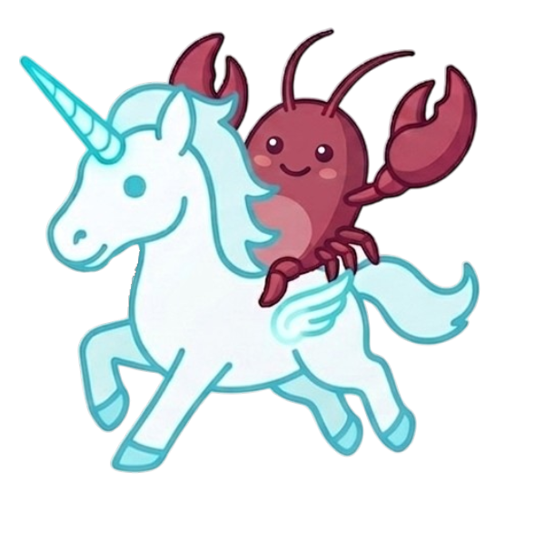
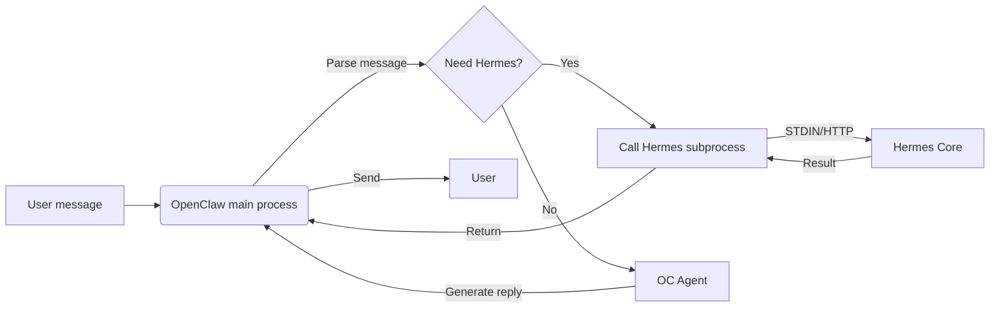
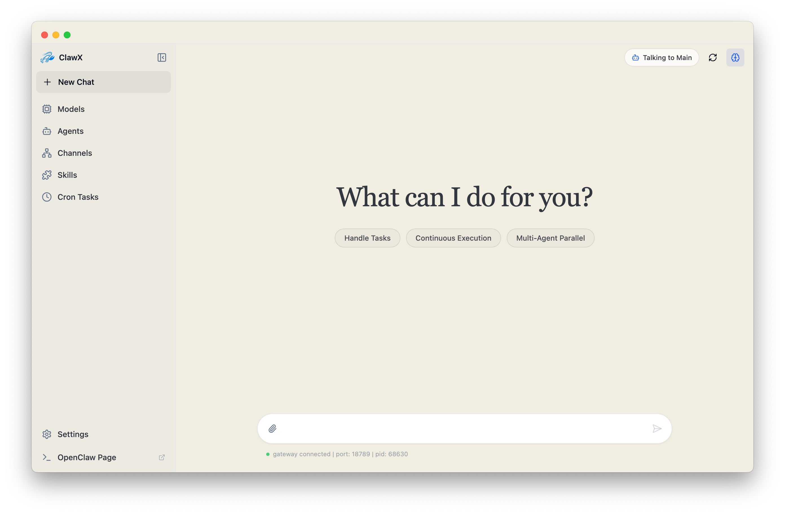
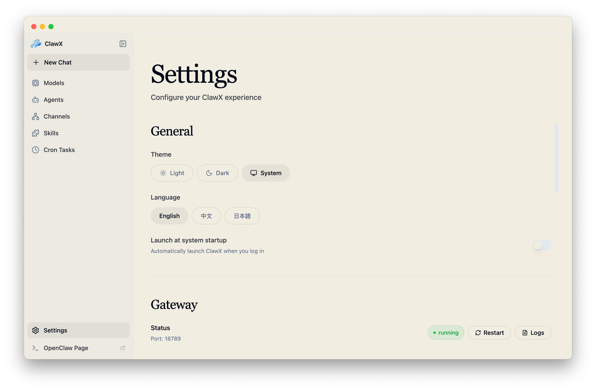

<p align="center">
  
</p>

<h1 align="center">HermesClaw</h1>

<p align="center">
  <strong>An open-source desktop workspace for OpenClaw and Hermes agents</strong>
</p>

<p align="center">
  <a href="#overview">Overview</a> ·
  <a href="#features">Features</a> ·
  <a href="#quick-start">Quick Start</a> ·
  <a href="#acknowledgements">Acknowledgements</a>
</p>

<p align="center">
  <a href="README.md">中文</a> · English
</p>

<p align="center">
  
  
  
  
</p>

---

## Overview

This README introduces HermesClaw as an open-source GitHub project. HermesClaw is an open-source desktop application for AI agents. It brings the runtime, configuration, and daily use of OpenClaw and Hermes into a visual workspace. Users can configure model providers, chat with agents, manage skills, connect channels, schedule tasks, and inspect runtime status without relying on the command line for everyday work.

HermesClaw is designed for users and developers who want to manage local AI-agent workflows. General users can get started through the graphical interface, while developers can read the source code, adjust runtime integrations, and extend the existing architecture.

OpenClaw-to-Hermes subprocess data flow:



## Features

- **Graphical onboarding**: Configure language, model providers, runtime mode, and built-in skills through the first-run setup flow.
- **Agent chat workspace**: Use Markdown messages, conversation history, and `@agent` routing to switch between agent contexts.
- **Runtime management**: Run OpenClaw, Hermes, or the `hermesclaw-both` mode where OpenClaw acts as the controller and integrates Hermes.
- **Model provider configuration**: Manage API keys, OAuth, custom OpenAI-compatible endpoints, and compatibility settings.
- **Skill and plugin management**: Browse, install, enable, and inspect OpenClaw skills and their on-disk directories.
- **Channels and scheduled tasks**: Configure external channels, account bindings, agent bindings, and recurring jobs.
- **Cross-platform desktop experience**: Built with Electron, React, and TypeScript for macOS, Windows, and Linux.

## Screenshots

<p align="center">
  
</p>

<p align="center">
  
</p>

## Quick Start

Clone this repository, then run the following commands in the project directory:

```bash
cd HermesClaw
pnpm run init
pnpm dev
```

## Development

Common commands:

```bash
pnpm install
pnpm run init
pnpm dev
pnpm run typecheck
pnpm run build:vite
```

Project structure:

```text
HermesClaw/
├── electron/        # Electron main process, runtime services, gateway management
├── src/             # React renderer application
├── resources/       # Runtime resources, CLI wrapper scripts, screenshots, and context files
├── scripts/         # Build, packaging, installer, and maintenance scripts
├── shared/          # Shared constants and types
└── tests/           # Unit and end-to-end tests
```

## Contributing

Issues, documentation improvements, translations, bug fixes, and feature suggestions are welcome. Before submitting a pull request, keep the change focused and explain how it affects users or developers.

## Acknowledgements

HermesClaw was made possible with thanks to Openclaw, HermesAgent, and ClawX.

We also thank the broader open-source community:

- **Openclaw / OpenClaw**: Provides the agent runtime foundation for HermesClaw.
- **HermesAgent**: Inspired Hermes integration, agent runtime design, and bridge direction.
- **ClawX**: Provided important references for the desktop product shape, interaction experience, and project foundation.

Thanks to everyone who contributes ideas, code, tests, and feedback.

## License

HermesClaw is open source under the [MIT License](LICENSE).
