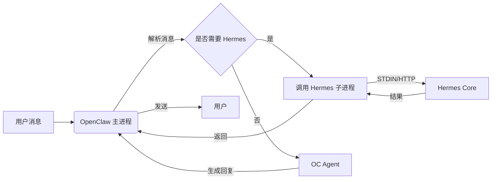

<p align="center">
  
</p>

<h1 align="center">HermesClaw</h1>

<p align="center">
  <strong>面向 OpenClaw 与 Hermes 智能体的开源桌面工作台</strong>
</p>

<p align="center">
  <a href="#项目介绍">项目介绍</a> ·
  <a href="#主要能力">主要能力</a> ·
  <a href="#快速开始">快速开始</a> ·
  <a href="#致谢">致谢</a>
</p>

<p align="center">
  中文 · <a href="README.en.md">English</a>
</p>

<p align="center">
  
  
  
  
</p>

---

## 项目介绍

这份 README 是 HermesClaw 作为 GitHub 开源库的项目介绍。HermesClaw 是一个开源的 AI 智能体桌面应用，目标是把 OpenClaw 与 Hermes 的运行、配置和日常使用整合到一个可视化工作台中。用户不需要长期依赖命令行，就可以完成模型供应商配置、智能体对话、技能管理、渠道接入、定时任务和运行时状态检查。

这个项目适合希望在本地管理 AI 智能体工作流的用户与开发者：普通用户可以通过图形界面快速开始，开发者也可以直接阅读源码、调整运行时集成方式，并基于现有架构继续扩展。

 OpenClaw 调用 Hermes 子进程的数据流示意：




## 主要能力

- **图形化初始化**：通过首次启动向导配置语言、模型供应商和内置技能；运行时默认使用 OpenClaw + Hermes 一体模式。
- **智能体聊天工作台**：支持 Markdown 消息、历史记录和 `@agent` 路由，方便在不同智能体上下文之间切换。
- **运行时管理**：以 `hermesclaw-both` 为主模式管理 OpenClaw 与 Hermes，支持设置页安装、检查更新、应用更新、回滚和启动时更新提醒。
- **模型供应商配置**：管理 API Key、OAuth、自定义 OpenAI 兼容端点、GitHub Copilot 授权和兼容性设置。
- **技能与插件管理**：浏览、安装、启用和查看 OpenClaw 技能及其实际目录。
- **渠道与定时任务**：配置外部渠道、账号绑定、智能体绑定和周期性任务。
- **跨平台桌面体验**：基于 Electron、React 与 TypeScript，面向 macOS、Windows 和 Linux。

## 截图

<p align="center">
  
</p>

<p align="center">
  
</p>

## 快速开始

### 运行环境

- **Node.js**：建议使用 Node.js 24，以保持与 CI 环境一致。
- **Python**：HermesAgent 打包运行时使用 Python 3.11.10；`pnpm run init` 会下载 uv 运行时，构建或打包 HermesAgent 时会通过 uv 创建对应 Python 虚拟环境。
- **包管理器**：使用 pnpm 10.31.0（项目已在 `packageManager` 中锁定版本）。
- **操作系统**：支持 macOS、Windows 和 Linux；本地开发需准备对应平台的 Electron 运行环境。
- **端口占用**：开发服务默认使用 `5173`，OpenClaw Gateway 默认使用 `18789`；如需调整，可参考 `.env.example`。
- **OpenClaw 版本**：打包基线由 `package.json` 固定为 `openclaw@2026.4.27`；构建时可通过 `OPENCLAW_VERSION` 或 `OPENCLAW_PACKAGE_SPEC` 覆盖，第三方 OpenClaw 插件镜像由 `pnpm run bundle:openclaw-plugins` 打包。
- **首次初始化**：首次运行前执行 `pnpm run init`，该命令会安装依赖并下载项目所需的 uv 运行时资源。

请先克隆本仓库，然后在项目目录中执行：

```bash
cd HermesClaw
pnpm run init
pnpm dev
```

## 开发

常用命令：

```bash
pnpm install
pnpm run init
pnpm dev
pnpm run typecheck
pnpm run build:vite
```

项目结构：

```text
HermesClaw/
├── electron/        # Electron Main、运行时服务、网关管理
├── src/             # React Renderer 应用
├── resources/       # 运行时资源、CLI 包装脚本、截图与上下文文件
├── scripts/         # 构建、打包、安装器和维护脚本
├── shared/          # 共享常量与类型
└── tests/           # 单元测试与端到端测试
```

## 贡献

欢迎提交 Issue、改进文档、补充翻译、修复问题或提出新功能建议。提交 Pull Request 前，请尽量保持改动聚焦，并说明这次改动对用户或开发者的影响。

## 致谢

备注：这个项目的完成需要感谢OpenClaw、HermesAgent和ClawX。

同时也感谢相关开源社区的长期积累：

- **OpenClaw**：为本项目提供智能体运行时基础。
- **HermesAgent**：为项目提供 Hermes 集成、智能体运行方式和桥接方向提供重要启发。
- **ClawX**：为桌面端产品形态、交互经验和项目基础提供了重要参考。

也感谢所有提供想法、代码、测试和反馈的贡献者。

## 许可证

HermesClaw 基于 [MIT License](LICENSE) 开源。
