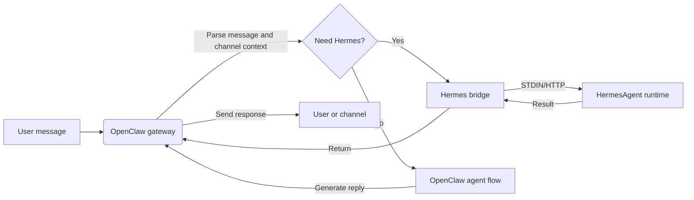

<p align="center">
  
</p>


<h1 align="center">HermesClaw</h1>

<p align="center">
  <strong>A desktop control plane for OpenClaw, Hermes agents, channels, skills, and local AI workflows</strong>
</p>

<p align="center">
  <a href="#overview">Overview</a> ·
  <a href="#why-hermesclaw-is-different">Why Different</a> ·
  <a href="#core-capabilities">Capabilities</a> ·
  <a href="#quick-start">Quick Start</a> ·
  <a href="#development">Development</a>
</p>

<p align="center">
  <a href="README_CN.md">中文</a> · English
</p>

<p align="center">
  
  
  
  
  
</p>

---

## Overview

HermesClaw is an open-source desktop workspace for running and managing AI agents. It combines the OpenClaw gateway, HermesAgent runtime, model-provider configuration, channels, skills, tasks, logs, and runtime maintenance into one cross-platform application.

The goal is not to build another chat-only shell. HermesClaw is designed as a local agent operations console: users get a graphical way to configure and operate agent workflows, while developers get a TypeScript/Electron codebase that packages OpenClaw, HermesAgent, plugin mirrors, preinstalled skills, and desktop update flows into a reproducible app.

HermesClaw is useful when you want a local-first agent desktop that can talk to model providers, run agent skills, connect to real messaging channels, and keep the underlying runtime visible and repairable.

## Why HermesClaw Is Different

- **Agent runtime control plane, not only chat**: HermesClaw exposes the practical parts of running agents: runtime status, provider keys, channels, skills, scheduled tasks, logs, updates, rollback, and repair.
- **OpenClaw + Hermes in one desktop flow**: The default combined mode lets OpenClaw handle gateway/channel orchestration while HermesAgent is packaged as a managed runtime resource.
- **Local-first and inspectable**: Runtime resources are bundled on disk, logs are reachable from the UI, and Settings includes doctor/repair flows instead of hiding failures behind a generic error.
- **Channel-ready by design**: Third-party OpenClaw channel plugins such as DingTalk, WeCom, Feishu/Lark, and Weixin are bundled or mirrored so packaged builds can install and upgrade them without asking users to manage `node_modules` manually.
- **Model-provider flexibility**: Users can configure API keys, OAuth-based providers, GitHub Copilot authorization, and OpenAI-compatible custom endpoints from the desktop app.
- **Developer-friendly packaging**: Build scripts prepare OpenClaw, HermesAgent, uv, Node binaries, preinstalled skills, extension bridges, installer assets, and platform-specific resources for Electron packaging.

## Core Capabilities

- **Graphical onboarding**: First-run setup covers language, runtime mode, model providers, and built-in skills.
- **Agent chat workspace**: Markdown conversation UI with history and `@agent` routing for switching agent context.
- **Runtime management**: Start, stop, restart, install, update, roll back, repair, and inspect OpenClaw and Hermes-related runtime components.
- **Provider management**: Configure API keys, OAuth credentials, default provider selection, compatibility options, custom OpenAI-compatible base URLs, and GitHub Copilot auth.
- **Skills and marketplace flows**: Browse, install, enable, and inspect OpenClaw skills, including ClawHub-backed skill and marketplace integration.
- **Channels and accounts**: Manage external channel plugins, account bindings, agent bindings, and channel startup synchronization.
- **Scheduled tasks**: Configure recurring jobs that connect agents to real workflows instead of one-off chat sessions.
- **Desktop updates**: Packaged builds use GitHub Releases for HermesClaw app updates and include runtime update/rollback flows for bundled agent resources.
- **Cross-platform app shell**: Electron + React + TypeScript renderer/main architecture for macOS, Windows, and Linux.

## Use Cases

- Run OpenClaw/Hermes locally without managing every runtime command by hand.
- Configure model providers and credentials through a desktop UI instead of editing config files.
- Connect agents to messaging channels and keep channel plugins updated in packaged builds.
- Inspect and repair local runtime state when gateway, plugin, or model configuration changes.
- Develop, test, and package a complete agent desktop distribution around OpenClaw and HermesAgent.

## Screenshots

<p align="center">
  
</p>

<p align="center">
  
</p>

## Runtime Architecture

HermesClaw has three main layers:

- **Renderer app**: React UI for chat, settings, setup, providers, channels, skills, and tasks.
- **Electron main process**: Owns the app lifecycle, secure IPC/API bridge, update handling, extension registry, gateway management, and runtime services.
- **Bundled agent runtimes**: OpenClaw gateway resources, HermesAgent Python runtime, OpenClaw plugin mirrors, CLI wrappers, uv, and platform-specific binaries.

OpenClaw-to-Hermes data flow:



## Quick Start

### Runtime environment

- **Node.js**: Node.js 24 is recommended to match the CI environment.
- **Python**: HermesAgent packaging uses Python 3.11.10; `pnpm run init` downloads the uv runtime, and HermesAgent builds/packages create the matching Python virtual environment through uv.
- **Package manager**: Use pnpm 10.31.0, as locked by the project's `packageManager` field.
- **Operating systems**: macOS, Windows, and Linux are supported; local development needs the Electron runtime environment for the target platform.
- **Ports**: The development server uses `5173` by default, and OpenClaw Gateway uses `18789` by default. See `.env.example` if you need to change them.
- **OpenClaw version**: The packaged baseline is pinned by `package.json` to `openclaw@2026.4.27`; builds can override it with `OPENCLAW_VERSION` or `OPENCLAW_PACKAGE_SPEC`.

Clone this repository, then run the following commands in the project directory:

```bash
cd HermesClaw
pnpm run init
pnpm dev
```

## Packaging

Build a local Windows installer:

```bash
pnpm run package:win
```

Build other platforms:

```bash
pnpm run package:mac
pnpm run package:linux
```

Packaging runs the same resource preparation used by release builds: extension bridge generation, Vite build, OpenClaw bundle, OpenClaw plugin mirrors, HermesAgent bundle, preinstalled skills, and Electron Builder packaging. Output goes to `release/`.

Do not run `pnpm run release` unless you intend to publish. The release workflow can push version tags and publish artifacts.

## Development

Common commands:

```bash
pnpm install
pnpm run init
pnpm dev
pnpm run typecheck
pnpm run test
pnpm run build:vite
```

Focused packaging commands:

```bash
pnpm run bundle:openclaw
pnpm run bundle:openclaw-plugins
pnpm run bundle:hermes-agent
pnpm run bundle:preinstalled-skills
pnpm run ext:bridge
```

Project structure:

```text
HermesClaw/
├── electron/        # Electron main process, runtime services, gateway management, preload
├── src/             # React renderer application
├── resources/       # Runtime resources, CLI wrappers, screenshots, and bundled assets
├── scripts/         # Build, packaging, installer, and maintenance scripts
├── shared/          # Shared constants and cross-process types
└── tests/           # Unit and end-to-end tests
```

## Contributing

Issues, documentation improvements, translations, bug fixes, tests, packaging fixes, and feature suggestions are welcome. Good contributions keep the change focused, explain the user impact, and include verification steps.

Useful contribution areas include:

- Improving Windows/macOS/Linux packaging reliability.
- Extending channel plugin support and runtime dependency bundling.
- Improving provider configuration and compatibility behavior.
- Expanding tests for runtime, gateway, and settings flows.
- Improving README, release notes, and localized documentation.

## Acknowledgements

HermesClaw was made possible with thanks to OpenClaw, HermesAgent, and ClawX.

- **OpenClaw**: Provides the agent gateway and runtime foundation.
- **HermesAgent**: Inspired Hermes integration, agent runtime design, and bridge direction.
- **ClawX**: Provided important references for desktop product shape, interaction experience, and project foundation.

Thanks to everyone who contributes ideas, code, tests, documentation, and feedback.

## License

HermesClaw is open source under the [MIT License](LICENSE).
