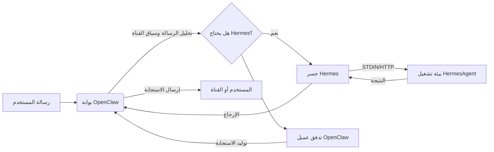

<p align="center">
  
</p>


<h1 align="center">HermesClaw</h1>

<p align="center">
  <strong>لوحة تحكم سطح المكتب لـ OpenClaw وعملاء Hermes والقنوات والمهارات وسير عمل الذكاء الاصطناعي المحلية</strong>
</p>

<p align="center">
  <a href="#نظرة-عامة">النظرة العامة</a> ·
  <a href="#لماذا-hermesclaw-مختلف">ما يميزه</a> ·
  <a href="#الإمكانيات-الأساسية">الإمكانيات</a> ·
  <a href="#البداية-السريعة">البداية السريعة</a> ·
  <a href="#التطوير">التطوير</a>
</p>

<p align="center">
  <a href="README_CN.md">中文</a> · <a href="README_ES.md">Español</a> · <a href="README_HI.md">Hindi</a> · العربية · <a href="README_PT.md">Português</a> · <a href="README_FR.md">Français</a> · <a href="README_RU.md">Русский</a> · <a href="README_JA.md">日本語</a> · <a href="README_DE.md">Deutsch</a> · <a href="README.md">English</a>
</p>

<p align="center">
  
  
  
  
  
</p>

<p align="center">
  <a href="https://github.com/NextAgentX/HermesClaw">
    
  </a>
</p>

<p align="center">
  <b>إذا وفّر لك HermesClaw الوقت أو ألهمك، فإن ⭐ على GitHub تعني الكثير — فهي تساعد الآخرين على اكتشاف هذا المشروع.</b>
</p>

---

## نظرة عامة

HermesClaw هو مساحة عمل مفتوحة المصدر لسطح المكتب لتشغيل وإدارة عملاء الذكاء الاصطناعي. يجمع بوابة OpenClaw وبيئة تشغيل HermesAgent وتكوين مزودي النماذج والقنوات والمهارات والمهام والسجلات وصيانة بيئة التشغيل في تطبيق واحد متعدد المنصات.

الهدف ليس بناء shell دردشة آخر. صُمِّم HermesClaw كوحدة تحكم عمليات عملاء محلية: يحصل المستخدمون على طريقة رسومية لتكوين وتشغيل سير عمل العملاء، بينما يحصل المطورون على قاعدة كود TypeScript/Electron تحزم OpenClaw وHermesAgent ومرايا المكونات الإضافية والمهارات المثبتة مسبقاً وتدفقات تحديثات سطح المكتب في تطبيق قابل للإعادة الإنتاج.

HermesClaw مفيد عندما تريد سطح مكتب عملاء محلياً يمكنه التواصل مع مزودي النماذج وتشغيل مهارات العملاء والاتصال بقنوات المراسلة الفعلية والحفاظ على بيئة التشغيل الأساسية مرئية وقابلة للإصلاح.

## لماذا HermesClaw مختلف

- **لوحة تحكم بيئة تشغيل العملاء، ليس مجرد دردشة**: يكشف HermesClaw الجوانب العملية لتشغيل العملاء: حالة بيئة التشغيل، ومفاتيح المزودين، والقنوات، والمهارات، والمهام المجدولة، والسجلات، والتحديثات، والتراجع، والإصلاح.
- **OpenClaw + Hermes في تدفق سطح مكتب واحد**: يسمح وضع الجمع الافتراضي لـ OpenClaw بمعالجة تنسيق البوابة/القناة بينما يتم تجميع HermesAgent كمورد بيئة تشغيل مُدار.
- **محلي أولاً وقابل للفحص**: تجميع موارد بيئة التشغيل على القرص، والسجلات متاحة من واجهة المستخدم، وتتضمن الإعدادات تدفقات doctor/repair بدلاً من إخفاء الأعطال خلف خطأ عام.
- **جاهز للقنوات بالتصميم**: يتم تجميع أو عكس مكونات قنوات OpenClaw التابعة لجهات خارجية مثل DingTalk وWeCom وFeishu/Lark وWeixin.
- **مرونة مزود النماذج**: يمكن للمستخدمين تكوين مفاتيح API والمزودين القائمين على OAuth وترخيص GitHub Copilot ونقاط نهاية مخصصة متوافقة مع OpenAI من تطبيق سطح المكتب.
- **حزم صديقة للمطورين**: تُعدّ برامج نصية البناء OpenClaw وHermesAgent وuv وثنائيات Node والمهارات المثبتة مسبقاً وجسور الامتداد وأصول المثبت والموارد الخاصة بالمنصة لحزم Electron.

## الإمكانيات الأساسية

- **الإعداد الرسومي**: يغطي إعداد الاستخدام الأول اللغة ووضع بيئة التشغيل ومزودي النماذج والمهارات المدمجة.
- **مساحة عمل دردشة العملاء**: واجهة محادثة Markdown مع السجل وتوجيه `@agent` للتبديل بين سياقات العملاء.
- **إدارة بيئة التشغيل**: تشغيل وإيقاف وإعادة تشغيل وتثبيت وتحديث والتراجع وإصلاح وفحص مكونات بيئة التشغيل المتعلقة بـ OpenClaw وHermes.
- **إدارة المزودين**: تكوين مفاتيح API وبيانات اعتماد OAuth واختيار المزود الافتراضي وخيارات التوافق وعناوين URL الأساسية المخصصة المتوافقة مع OpenAI وترخيص GitHub Copilot.
- **المهارات وتدفقات السوق**: استكشاف وتثبيت وتمكين وفحص مهارات OpenClaw.
- **القنوات والحسابات**: إدارة مكونات القنوات الخارجية وربط الحسابات وربط العملاء ومزامنة بدء تشغيل القناة.
- **المهام المجدولة**: تكوين وظائف متكررة تربط العملاء بسير عمل فعلية بدلاً من جلسات دردشة فردية.
- **تحديثات سطح المكتب**: تستخدم الإصدارات المحزومة GitHub Releases لتحديثات تطبيق HermesClaw.
- **غلاف تطبيق متعدد المنصات**: بنية Electron + React + TypeScript renderer/main لـ macOS وWindows وLinux.

## حالات الاستخدام

- تشغيل OpenClaw/Hermes محلياً دون إدارة كل أمر بيئة تشغيل يدوياً.
- تكوين مزودي النماذج وبيانات الاعتماد عبر واجهة مستخدم سطح المكتب بدلاً من تعديل ملفات التكوين.
- ربط العملاء بقنوات المراسلة والحفاظ على تحديث مكونات القنوات في الإصدارات المحزومة.
- فحص وإصلاح حالة بيئة التشغيل المحلية عند تغيير تكوين البوابة أو المكون الإضافي أو النموذج.
- تطوير واختبار وحزم توزيع كامل لسطح مكتب عملاء حول OpenClaw وHermesAgent.

## لقطات الشاشة

<p align="center">
  
</p>

<p align="center">
  
</p>

<p align="center">
  
</p>

<p align="center">
  
</p>

<p align="center">
  
</p>

<p align="center">
  
</p>

<p align="center">
  
</p>

<p align="center">
  
</p>

## بنية بيئة التشغيل

يحتوي HermesClaw على ثلاث طبقات رئيسية:

- **عارض التطبيق**: واجهة مستخدم React للدردشة والإعدادات والإعداد والمزودين والقنوات والمهارات والمهام.
- **العملية الرئيسية لـ Electron**: تدير دورة حياة التطبيق وجسر IPC/API الآمن ومعالجة التحديثات وسجل الامتداد وإدارة البوابة وخدمات بيئة التشغيل.
- **بيئات تشغيل العملاء المحزومة**: موارد بوابة OpenClaw وبيئة تشغيل Python لـ HermesAgent ومرايا مكونات OpenClaw الإضافية وأغلفة CLI وuv والثنائيات الخاصة بالمنصة.

تدفق البيانات من OpenClaw إلى Hermes:



## البداية السريعة

### بيئة التشغيل

- **Node.js**: يُوصى بـ Node.js 24 للتوافق مع بيئة CI.
- **Python**: تستخدم حزم HermesAgent Python 3.11.10؛ يقوم `pnpm run init` بتنزيل بيئة تشغيل uv.
- **مدير الحزم**: استخدم pnpm 10.31.0، مقيّد بحقل `packageManager` للمشروع.
- **أنظمة التشغيل**: macOS وWindows وLinux مدعومة.
- **المنافذ**: يستخدم خادم التطوير `5173` بشكل افتراضي، وبوابة OpenClaw `18789` بشكل افتراضي.
- **إصدار OpenClaw**: الأساس المحزوم مثبّت على `openclaw@2026.4.27`.

انسخ هذا المستودع وشغّل الأوامر التالية في دليل المشروع:

```bash
cd HermesClaw
pnpm run init
pnpm dev
```

## الحزم

بناء مثبت Windows محلي:

```bash
pnpm run package:win
```

بناء منصات أخرى:

```bash
pnpm run package:mac
pnpm run package:linux
```

## التطوير

الأوامر الشائعة:

```bash
pnpm install
pnpm run init
pnpm dev
pnpm run typecheck
pnpm run test
pnpm run build:vite
```

هيكل المشروع:

```text
HermesClaw/
├── electron/        # العملية الرئيسية لـ Electron، خدمات بيئة التشغيل، إدارة البوابة، preload
├── src/             # تطبيق React renderer
├── resources/       # موارد بيئة التشغيل، أغلفة CLI، لقطات الشاشة والأصول المحزومة
├── scripts/         # برامج نصية للبناء والحزم والمثبت والصيانة
├── shared/          # الثوابت والأنواع المشتركة بين العمليات
└── tests/           # اختبارات الوحدة والنهاية إلى النهاية
```

## المساهمة

نرحب بالمشكلات وتحسينات التوثيق والترجمات وإصلاحات الأخطاء والاختبارات وإصلاحات الحزم واقتراحات الميزات.

## شكر وتقدير

أصبح HermesClaw ممكناً بفضل OpenClaw وHermesAgent وClawX.

- **OpenClaw**: يوفر بوابة العميل وأساس بيئة التشغيل.
- **HermesAgent**: ألهم تكامل Hermes وتصميم بيئة تشغيل العميل واتجاه الجسر.
- **ClawX**: قدّم مراجع مهمة لشكل منتج سطح المكتب وتجربة التفاعل.

## الرخصة

HermesClaw مفتوح المصدر بموجب [رخصة MIT](LICENSE).

---

<p align="center">
  <b>هل وجدت HermesClaw مفيداً؟ أعطه ⭐ على GitHub — إنها تساعد المشروع على النمو والوصول إلى المطورين الآخرين الذين يعملون مع عملاء الذكاء الاصطناعي المحليين.</b><br/>
  <a href="https://github.com/NextAgentX/HermesClaw">⭐ أعط HermesClaw نجمة على GitHub</a>
</p>
