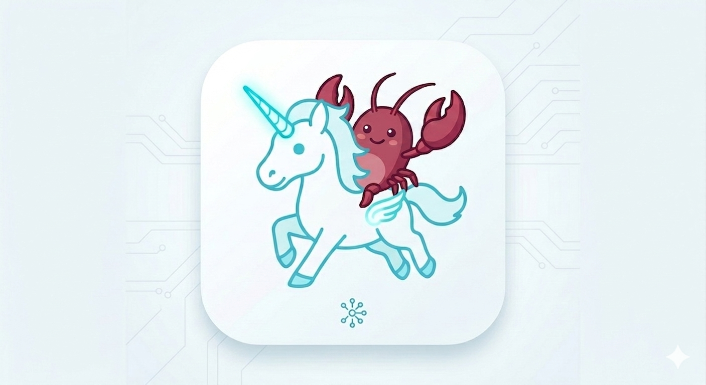
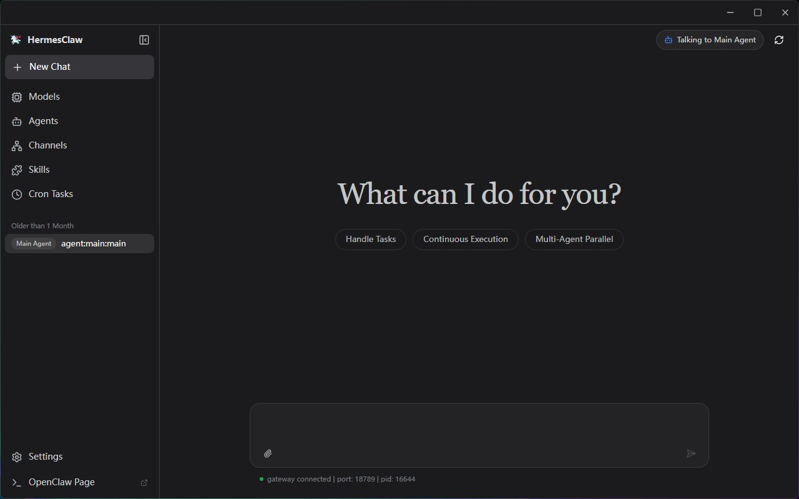
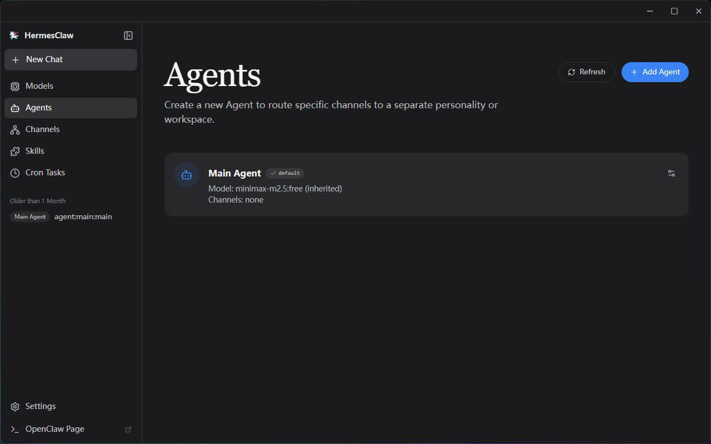
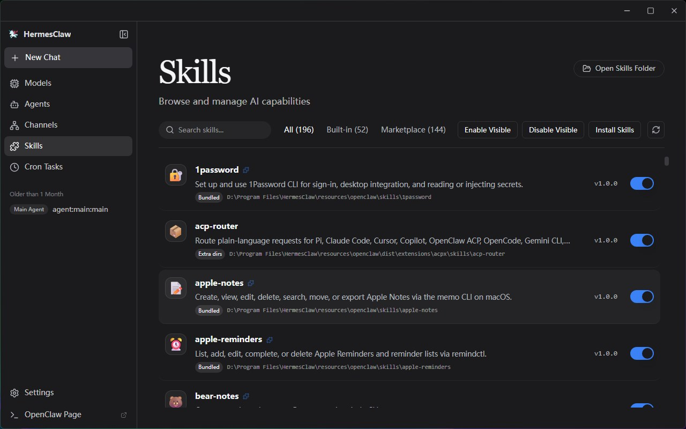
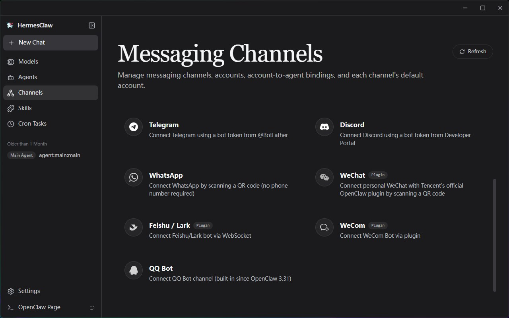
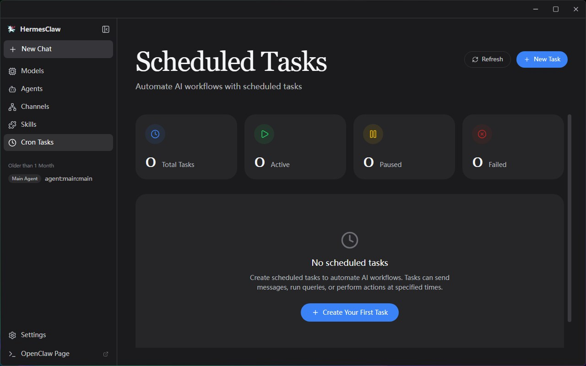
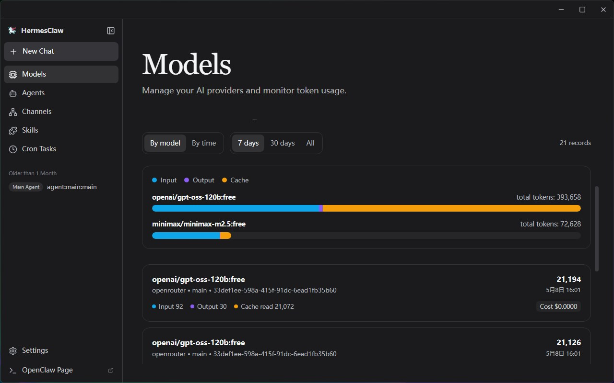
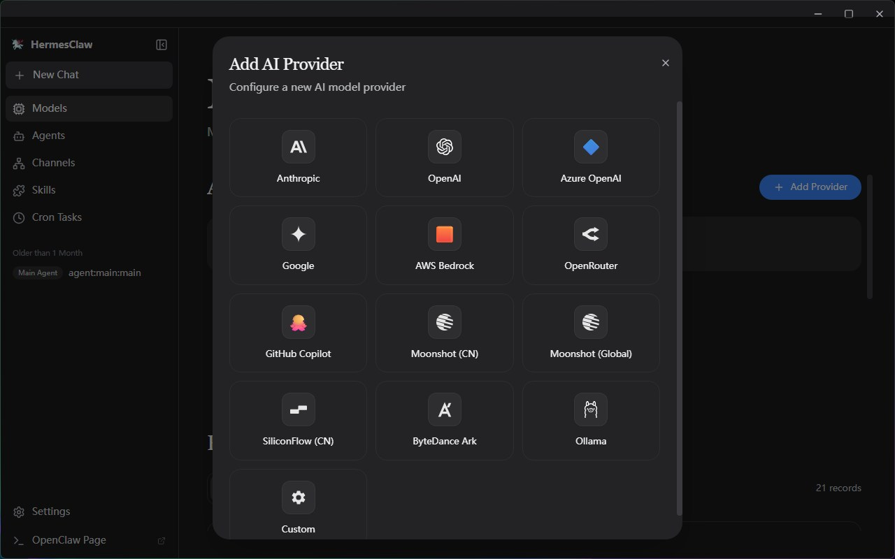
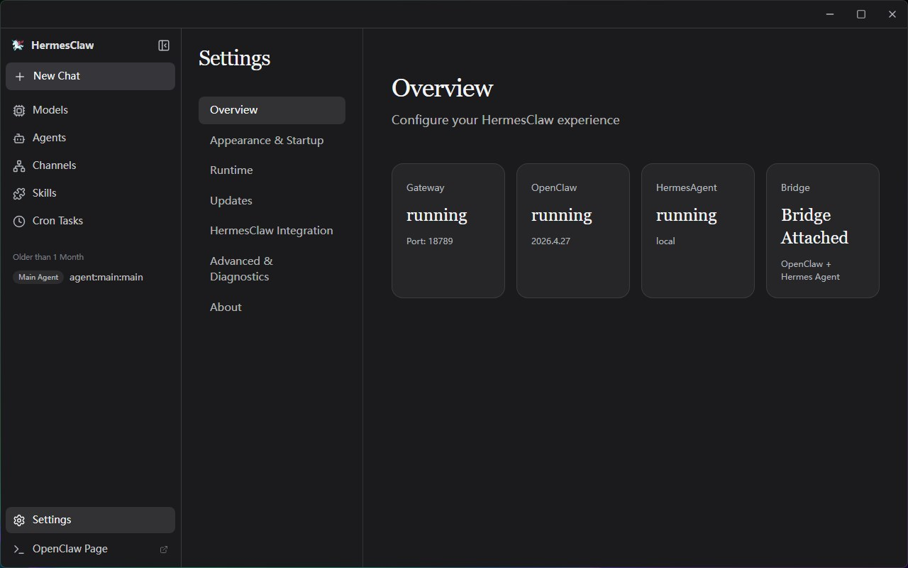
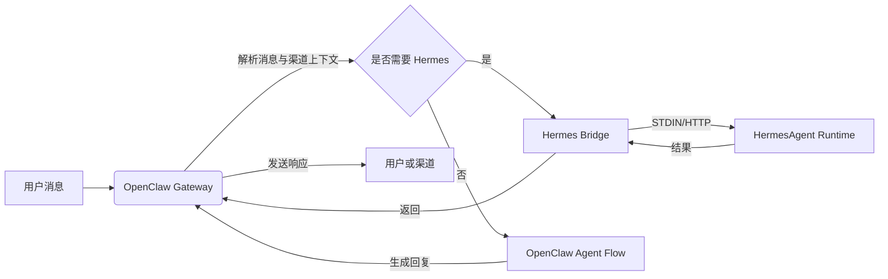

<p align="center">
  
</p>


<h1 align="center">HermesClaw</h1>

<p align="center">
  <strong>面向 OpenClaw、Hermes 智能体、渠道、技能与本地 AI 工作流的桌面控制台</strong>
</p>

<p align="center">
  <a href="#项目介绍">项目介绍</a> ·
  <a href="#为什么-hermesclaw-不一样">差异化特点</a> ·
  <a href="#核心能力">核心能力</a> ·
  <a href="#快速开始">快速开始</a> ·
  <a href="#开发">开发</a>
</p>

<p align="center">
  中文 · <a href="README.md">English</a>
</p>

<p align="center">
  
  
  
  
  
</p>

---

## 项目介绍

HermesClaw 是一个开源桌面工作台，用于运行和管理 AI 智能体。它把 OpenClaw Gateway、HermesAgent 运行时、模型供应商配置、渠道、技能、任务、日志和运行时维护整合到一个跨平台桌面应用中。

HermesClaw 的目标不是再做一个普通聊天壳。它更像一个本地智能体运维控制台：用户可以通过图形界面配置和操作智能体工作流，开发者则可以基于 TypeScript/Electron 代码库，把 OpenClaw、HermesAgent、插件镜像、预装技能和桌面更新流程打包成可复现的应用。

如果你需要一个本地优先的智能体桌面应用，并希望它能连接模型供应商、运行技能、接入真实消息渠道，同时让底层运行时可见、可诊断、可修复，HermesClaw 就是为这个场景设计的。

## 为什么 HermesClaw 不一样

- **不只是聊天界面，而是智能体运行控制台**：HermesClaw 暴露了真正运行智能体时需要管理的部分，包括运行状态、模型密钥、渠道、技能、定时任务、日志、更新、回滚和修复。
- **OpenClaw + Hermes 的一体化桌面流程**：默认组合模式由 OpenClaw 负责网关和渠道编排，HermesAgent 作为受管理的运行时资源随应用打包。
- **本地优先且可检查**：运行时资源以文件形式打包到本地，日志可以从界面打开，设置页提供 doctor/repair 流程，而不是把问题隐藏成笼统错误。
- **面向真实渠道场景**：钉钉、企微、飞书/Lark、微信等 OpenClaw 第三方渠道插件会被打包或镜像，安装包可以自动安装和升级插件，用户不需要手动维护 `node_modules`。
- **模型供应商灵活配置**：用户可以在桌面应用里配置 API Key、OAuth 类型供应商、GitHub Copilot 授权，以及 OpenAI 兼容自定义端点。
- **对开发者友好的打包体系**：构建脚本会准备 OpenClaw、HermesAgent、uv、Node 二进制、预装技能、扩展桥、安装器资产和平台资源，降低桌面分发复杂度。

## 核心能力

- **图形化初始化**：首次启动向导覆盖语言、运行时模式、模型供应商和内置技能配置。
- **智能体聊天工作台**：支持 Markdown 会话、历史记录和 `@agent` 路由，方便切换智能体上下文。
- **运行时管理**：支持启动、停止、重启、安装、更新、回滚、修复和检查 OpenClaw 与 Hermes 相关运行组件。
- **模型供应商管理**：配置 API Key、OAuth 凭据、默认供应商、兼容性选项、自定义 OpenAI 兼容 Base URL 和 GitHub Copilot 授权。
- **技能与市场流程**：浏览、安装、启用和检查 OpenClaw 技能，并集成 ClawHub 技能与市场能力。
- **渠道与账号**：管理外部渠道插件、账号绑定、智能体绑定和渠道启动同步。
- **定时任务**：配置周期性任务，让智能体进入真实工作流，而不只是一次性聊天。
- **桌面更新**：打包应用通过 GitHub Releases 检测 HermesClaw 应用更新，并提供运行时资源的更新/回滚流程。
- **跨平台桌面外壳**：基于 Electron + React + TypeScript，面向 macOS、Windows 和 Linux。

## 适用场景

- 在本地运行 OpenClaw/Hermes，而不需要手动管理每一条运行命令。
- 通过桌面界面配置模型供应商和凭据，而不是直接编辑配置文件。
- 将智能体接入消息渠道，并让打包应用维护渠道插件。
- 当网关、插件或模型配置变化时，检查和修复本地运行状态。
- 围绕 OpenClaw 与 HermesAgent 开发、测试和打包完整的智能体桌面发行版。

## 截图

<p align="center">
  
</p>

<p align="center">
  
</p>

<p align="center">
  
</p>

<p align="center">
  
</p>

<p align="center">
  
</p>

<p align="center">
  
</p>

<p align="center">
  
</p>

<p align="center">
  
</p>

## 运行时架构

HermesClaw 主要由三层组成：

- **Renderer 应用**：React UI，负责聊天、设置、初始化、供应商、渠道、技能和任务界面。
- **Electron Main 进程**：负责应用生命周期、安全 IPC/API 桥、更新处理、扩展注册、网关管理和运行时服务。
- **打包的智能体运行时**：OpenClaw Gateway 资源、HermesAgent Python 运行时、OpenClaw 插件镜像、CLI 包装脚本、uv 和平台二进制资源。

OpenClaw 调用 Hermes 的数据流示意：



## 快速开始

### 运行环境

- **Node.js**：建议使用 Node.js 24，以保持与 CI 环境一致。
- **Python**：HermesAgent 打包运行时使用 Python 3.11.10；`pnpm run init` 会下载 uv 运行时，构建或打包 HermesAgent 时会通过 uv 创建对应 Python 虚拟环境。
- **包管理器**：使用 pnpm 10.31.0（项目已在 `packageManager` 中锁定版本）。
- **操作系统**：支持 macOS、Windows 和 Linux；本地开发需准备对应平台的 Electron 运行环境。
- **端口占用**：开发服务默认使用 `5173`，OpenClaw Gateway 默认使用 `18789`；如需调整，可参考 `.env.example`。
- **OpenClaw 版本**：打包基线由 `package.json` 固定为 `openclaw@2026.4.27`；构建时可通过 `OPENCLAW_VERSION` 或 `OPENCLAW_PACKAGE_SPEC` 覆盖。

请先克隆本仓库，然后在项目目录中执行：

```bash
cd HermesClaw
pnpm run init
pnpm dev
```

## 打包

构建本地 Windows 安装包：

```bash
pnpm run package:win
```

构建其他平台安装包：

```bash
pnpm run package:mac
pnpm run package:linux
```

打包流程会执行与发布构建一致的资源准备：扩展桥生成、Vite 构建、OpenClaw 打包、OpenClaw 插件镜像、HermesAgent 打包、预装技能和 Electron Builder 打包。产物输出到 `release/`。

除非确实要发布版本，否则不要运行 `pnpm run release`。发布流程可能推送版本标签并发布构建产物。

## 开发

常用命令：

```bash
pnpm install
pnpm run init
pnpm dev
pnpm run typecheck
pnpm run test
pnpm run build:vite
```

聚焦打包相关命令：

```bash
pnpm run bundle:openclaw
pnpm run bundle:openclaw-plugins
pnpm run bundle:hermes-agent
pnpm run bundle:preinstalled-skills
pnpm run ext:bridge
```

项目结构：

```text
HermesClaw/
├── electron/        # Electron Main、运行时服务、网关管理、Preload
├── src/             # React Renderer 应用
├── resources/       # 运行时资源、CLI 包装脚本、截图与打包资产
├── scripts/         # 构建、打包、安装器和维护脚本
├── shared/          # 共享常量与跨进程类型
└── tests/           # 单元测试与端到端测试
```

## 贡献

欢迎提交 Issue、改进文档、补充翻译、修复问题、补充测试、改进打包流程或提出新功能建议。好的贡献应该保持改动聚焦，说明用户影响，并提供验证步骤。

适合贡献的方向包括：

- 改进 Windows/macOS/Linux 打包稳定性。
- 扩展渠道插件支持和运行时依赖打包能力。
- 改进模型供应商配置和兼容性行为。
- 补充运行时、网关和设置流程测试。
- 改进 README、发布说明和多语言文档。

## 致谢

HermesClaw 的完成离不开 OpenClaw、HermesAgent 和 ClawX。

- **OpenClaw**：为本项目提供智能体网关和运行时基础。
- **HermesAgent**：为 Hermes 集成、智能体运行方式和桥接方向提供重要启发。
- **ClawX**：为桌面端产品形态、交互经验和项目基础提供重要参考。

感谢所有提供想法、代码、测试、文档和反馈的贡献者。

## 许可证

HermesClaw 基于 [MIT License](LICENSE) 开源。
