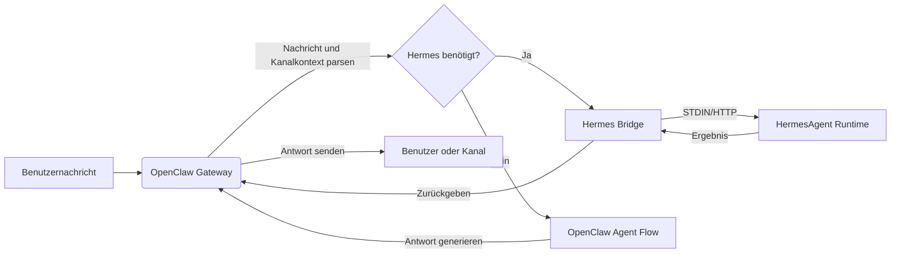

<p align="center">
  
</p>


<h1 align="center">HermesClaw</h1>

<p align="center">
  <strong>Ein Desktop-Kontrollzentrum für OpenClaw, Hermes-Agenten, Kanäle, Fähigkeiten und lokale KI-Workflows</strong>
</p>

<p align="center">
  <a href="#überblick">Überblick</a> ·
  <a href="#warum-hermesclaw-anders-ist">Unterschiede</a> ·
  <a href="#kernfähigkeiten">Fähigkeiten</a> ·
  <a href="#schnellstart">Schnellstart</a> ·
  <a href="#entwicklung">Entwicklung</a>
</p>

<p align="center">
  <a href="README_CN.md">中文</a> · <a href="README_ES.md">Español</a> · <a href="README_HI.md">Hindi</a> · <a href="README_AR.md">العربية</a> · <a href="README_PT.md">Português</a> · <a href="README_FR.md">Français</a> · <a href="README_RU.md">Русский</a> · <a href="README_JA.md">日本語</a> · Deutsch · <a href="README.md">English</a>
</p>

<p align="center">
  
  
  
  
  
</p>

<p align="center">
  <a href="https://github.com/NextAgentX/HermesClaw">
    
  </a>
</p>

<p align="center">
  <b>Wenn HermesClaw Ihnen Zeit gespart oder Sie inspiriert hat, bedeutet ein ⭐ auf GitHub viel — es hilft anderen, dieses Projekt zu entdecken.</b>
</p>

---

## Überblick

HermesClaw ist ein Open-Source-Desktop-Arbeitsbereich zum Ausführen und Verwalten von KI-Agenten. Es kombiniert das OpenClaw-Gateway, die HermesAgent-Runtime, die Konfiguration von Modellanbietern, Kanäle, Fähigkeiten, Aufgaben, Protokolle und Runtime-Wartung in einer einzigen plattformübergreifenden Anwendung.

Das Ziel ist nicht, eine weitere Chat-Shell zu bauen. HermesClaw ist als lokale Agenten-Betriebskonsole konzipiert: Benutzer erhalten eine grafische Möglichkeit, Agenten-Workflows zu konfigurieren und zu betreiben, während Entwickler eine TypeScript/Electron-Codebasis erhalten, die OpenClaw, HermesAgent, Plugin-Spiegel, vorinstallierte Fähigkeiten und Desktop-Update-Flows in einer reproduzierbaren App bündelt.

HermesClaw ist nützlich, wenn Sie einen lokalen Agenten-Desktop wünschen, der mit Modellanbietern kommunizieren, Agentenfähigkeiten ausführen, sich mit echten Messaging-Kanälen verbinden und die zugrunde liegende Runtime sichtbar und reparierbar halten kann.

## Warum HermesClaw Anders Ist

- **Agenten-Runtime-Dashboard, nicht nur Chat**: HermesClaw legt die praktischen Aspekte des Betriebs von Agenten offen: Runtime-Status, Anbieter-Keys, Kanäle, Fähigkeiten, geplante Aufgaben, Protokolle, Updates, Rollback und Reparatur.
- **OpenClaw + Hermes in einem einzigen Desktop-Flow**: Der Standard-Kombinationsmodus lässt OpenClaw die Gateway/Kanal-Orchestrierung übernehmen, während HermesAgent als verwaltete Runtime-Ressource gebündelt wird.
- **Local-first und inspizierbar**: Runtime-Ressourcen werden auf der Festplatte gebündelt, Protokolle sind über die Benutzeroberfläche zugänglich, und die Einstellungen enthalten Doctor/Repair-Flows anstatt Fehler hinter einem generischen Fehler zu verstecken.
- **Von Anfang an kanalbereit**: Drittanbieter-OpenClaw-Kanal-Plugins wie DingTalk, WeCom, Feishu/Lark und Weixin werden gebündelt oder gespiegelt.
- **Modellanbieter-Flexibilität**: Benutzer können API-Keys, OAuth-basierte Anbieter, GitHub Copilot-Autorisierung und benutzerdefinierte OpenAI-kompatible Endpunkte über die Desktop-Anwendung konfigurieren.
- **Entwicklerfreundliche Paketierung**: Build-Skripte bereiten OpenClaw, HermesAgent, uv, Node-Binärdateien, vorinstallierte Fähigkeiten, Erweiterungs-Bridges, Installer-Assets und plattformspezifische Ressourcen für die Electron-Paketierung vor.

## Kernfähigkeiten

- **Grafisches Onboarding**: Das Ersteinrichtungs-Setup umfasst Sprache, Runtime-Modus, Modellanbieter und integrierte Fähigkeiten.
- **Agenten-Chat-Arbeitsbereich**: Markdown-Konversationsschnittstelle mit Verlauf und `@agent`-Routing zum Wechseln des Agentenkontexts.
- **Runtime-Verwaltung**: OpenClaw- und Hermes-bezogene Runtime-Komponenten starten, stoppen, neu starten, installieren, aktualisieren, zurücksetzen, reparieren und inspizieren.
- **Anbieterverwaltung**: API-Keys, OAuth-Anmeldedaten, Standard-Anbieterauswahl, Kompatibilitätsoptionen, benutzerdefinierte OpenAI-kompatible Basis-URLs und GitHub Copilot-Autorisierung konfigurieren.
- **Fähigkeiten und Marketplace-Flows**: OpenClaw-Fähigkeiten erkunden, installieren, aktivieren und inspizieren.
- **Kanäle und Konten**: Externe Kanal-Plugins, Kontobindungen, Agentenbindungen und Kanal-Start-Synchronisation verwalten.
- **Geplante Aufgaben**: Wiederkehrende Jobs konfigurieren, die Agenten mit realen Workflows statt mit einmaligen Chat-Sitzungen verbinden.
- **Desktop-Updates**: Gepackte Builds verwenden GitHub Releases für HermesClaw-App-Updates.
- **Plattformübergreifende App-Shell**: Electron + React + TypeScript Renderer/Main-Architektur für macOS, Windows und Linux.

## Anwendungsfälle

- OpenClaw/Hermes lokal ausführen, ohne jeden Runtime-Befehl manuell zu verwalten.
- Modellanbieter und Anmeldedaten über eine Desktop-Benutzeroberfläche konfigurieren statt Konfigurationsdateien zu bearbeiten.
- Agenten mit Messaging-Kanälen verbinden und Kanal-Plugins in gepackten Builds aktuell halten.
- Den lokalen Runtime-Zustand inspizieren und reparieren, wenn sich Gateway-, Plugin- oder Modellkonfiguration ändert.
- Eine vollständige Agenten-Desktop-Distribution rund um OpenClaw und HermesAgent entwickeln, testen und paketieren.

## Screenshots

<p align="center">
  
</p>

<p align="center">
  
</p>

<p align="center">
  
</p>

<p align="center">
  
</p>

<p align="center">
  
</p>

<p align="center">
  
</p>

<p align="center">
  
</p>

<p align="center">
  
</p>

## Runtime-Architektur

HermesClaw hat drei Hauptschichten:

- **App-Renderer**: React-UI für Chat, Einstellungen, Setup, Anbieter, Kanäle, Fähigkeiten und Aufgaben.
- **Electron-Hauptprozess**: Verwaltet den App-Lebenszyklus, die sichere IPC/API-Bridge, Update-Handling, Erweiterungsregistry, Gateway-Verwaltung und Runtime-Services.
- **Gebündelte Agenten-Runtimes**: OpenClaw-Gateway-Ressourcen, HermesAgent-Python-Runtime, OpenClaw-Plugin-Spiegel, CLI-Wrapper, uv und plattformspezifische Binärdateien.

Datenfluss von OpenClaw zu Hermes:



## Schnellstart

### Runtime-Umgebung

- **Node.js**: Node.js 24 wird empfohlen, um mit der CI-Umgebung übereinzustimmen.
- **Python**: HermesAgent-Paketierung verwendet Python 3.11.10; `pnpm run init` lädt die uv-Runtime herunter.
- **Paketmanager**: Verwenden Sie pnpm 10.31.0, gesperrt durch das `packageManager`-Feld des Projekts.
- **Betriebssysteme**: macOS, Windows und Linux werden unterstützt.
- **Ports**: Der Dev-Server verwendet standardmäßig `5173`, das OpenClaw Gateway `18789`.
- **OpenClaw-Version**: Die gebündelte Baseline ist auf `openclaw@2026.4.27` festgelegt.

Klonen Sie dieses Repository und führen Sie die folgenden Befehle im Projektverzeichnis aus:

```bash
cd HermesClaw
pnpm run init
pnpm dev
```

## Paketierung

Einen lokalen Windows-Installer erstellen:

```bash
pnpm run package:win
```

Andere Plattformen erstellen:

```bash
pnpm run package:mac
pnpm run package:linux
```

## Entwicklung

Häufige Befehle:

```bash
pnpm install
pnpm run init
pnpm dev
pnpm run typecheck
pnpm run test
pnpm run build:vite
```

Projektstruktur:

```text
HermesClaw/
├── electron/        # Electron-Hauptprozess, Runtime-Services, Gateway-Verwaltung, Preload
├── src/             # React-Renderer-Anwendung
├── resources/       # Runtime-Ressourcen, CLI-Wrapper, Screenshots und gebündelte Assets
├── scripts/         # Build-, Paketierungs-, Installer- und Wartungsskripte
├── shared/          # Gemeinsame Konstanten und Typen zwischen Prozessen
└── tests/           # Unit- und End-to-End-Tests
```

## Mitwirken

Issues, Dokumentationsverbesserungen, Übersetzungen, Fehlerbehebungen, Tests, Paketierungskorrekturen und Feature-Vorschläge sind willkommen.

## Danksagungen

HermesClaw wurde durch OpenClaw, HermesAgent und ClawX möglich.

- **OpenClaw**: Stellt das Agenten-Gateway und die Runtime-Grundlage bereit.
- **HermesAgent**: Inspirierte die Hermes-Integration, das Agenten-Runtime-Design und die Bridge-Richtung.
- **ClawX**: Lieferte wichtige Referenzen für die Desktop-Produktform und die Interaktionserfahrung.

## Lizenz

HermesClaw ist Open-Source unter der [MIT-Lizenz](LICENSE).

---

<p align="center">
  <b>War HermesClaw nützlich für Sie? Geben Sie ihm ein ⭐ auf GitHub — das hilft dem Projekt zu wachsen und andere Entwickler zu erreichen, die mit lokalen KI-Agenten arbeiten.</b><br/>
  <a href="https://github.com/NextAgentX/HermesClaw">⭐ HermesClaw auf GitHub einen Stern geben</a>
</p>
