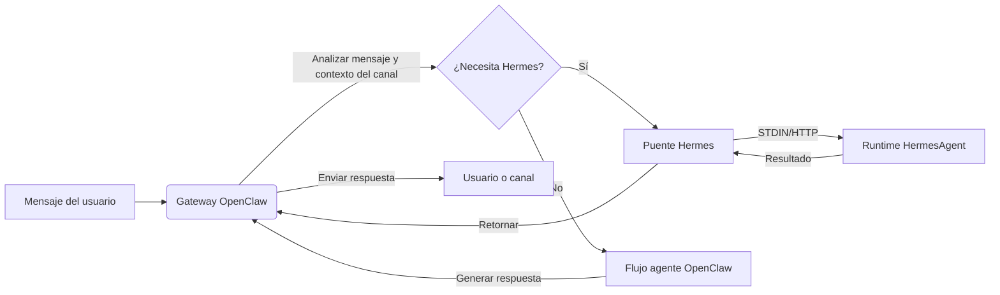

<p align="center">
  
</p>


<h1 align="center">HermesClaw</h1>

<p align="center">
  <strong>Un panel de control de escritorio para OpenClaw, agentes Hermes, canales, habilidades y flujos de trabajo de IA local</strong>
</p>

<p align="center">
  <a href="#descripción-general">Descripción</a> ·
  <a href="#por-qué-hermesclaw-es-diferente">Diferencias</a> ·
  <a href="#capacidades-principales">Capacidades</a> ·
  <a href="#inicio-rápido">Inicio Rápido</a> ·
  <a href="#desarrollo">Desarrollo</a>
</p>

<p align="center">
  <a href="README_CN.md">中文</a> · Español · <a href="README_HI.md">Hindi</a> · <a href="README_AR.md">العربية</a> · <a href="README_PT.md">Português</a> · <a href="README_FR.md">Français</a> · <a href="README_RU.md">Русский</a> · <a href="README_JA.md">日本語</a> · <a href="README_DE.md">Deutsch</a> · <a href="README.md">English</a>
</p>

<p align="center">
  
  
  
  
  
</p>

<p align="center">
  <a href="https://github.com/NextAgentX/HermesClaw">
    
  </a>
</p>

<p align="center">
  <b>Si HermesClaw te ahorra tiempo o te inspira, una ⭐ en GitHub significa mucho — ayuda a que otros descubran este proyecto.</b>
</p>

---

## Descripción General

HermesClaw es un espacio de trabajo de escritorio de código abierto para ejecutar y gestionar agentes de IA. Combina el gateway OpenClaw, el runtime HermesAgent, la configuración de proveedores de modelos, canales, habilidades, tareas, registros y mantenimiento del runtime en una sola aplicación multiplataforma.

El objetivo no es construir otro shell solo de chat. HermesClaw está diseñado como una consola de operaciones de agentes local: los usuarios obtienen una forma gráfica de configurar y operar flujos de trabajo de agentes, mientras que los desarrolladores obtienen una base de código TypeScript/Electron que empaqueta OpenClaw, HermesAgent, espejos de plugins, habilidades preinstaladas y flujos de actualización de escritorio en una aplicación reproducible.

HermesClaw es útil cuando deseas un escritorio de agentes local que pueda comunicarse con proveedores de modelos, ejecutar habilidades de agentes, conectarse a canales de mensajería reales y mantener el runtime subyacente visible y reparable.

## Por Qué HermesClaw Es Diferente

- **Panel de control del runtime de agentes, no solo chat**: HermesClaw expone las partes prácticas de ejecutar agentes: estado del runtime, claves de proveedor, canales, habilidades, tareas programadas, registros, actualizaciones, reversión y reparación.
- **OpenClaw + Hermes en un solo flujo de escritorio**: El modo combinado predeterminado permite que OpenClaw maneje la orquestación del gateway/canal mientras HermesAgent se empaqueta como un recurso de runtime gestionado.
- **Local-first e inspeccionable**: Los recursos del runtime se agrupan en disco, los registros son accesibles desde la interfaz y Configuración incluye flujos de doctor/reparación en lugar de ocultar fallos detrás de un error genérico.
- **Listo para canales por diseño**: Los plugins de canales OpenClaw de terceros como DingTalk, WeCom, Feishu/Lark y Weixin se agrupan o reflejan para que las compilaciones empaquetadas puedan instalarlos y actualizarlos sin pedir a los usuarios que gestionen `node_modules` manualmente.
- **Flexibilidad de proveedor de modelos**: Los usuarios pueden configurar claves API, proveedores basados en OAuth, autorización de GitHub Copilot y endpoints personalizados compatibles con OpenAI desde la aplicación de escritorio.
- **Empaquetado amigable para desarrolladores**: Los scripts de compilación preparan OpenClaw, HermesAgent, uv, binarios de Node, habilidades preinstaladas, puentes de extensión, activos del instalador y recursos específicos de plataforma para el empaquetado de Electron.

## Capacidades Principales

- **Incorporación gráfica**: La configuración de primer uso cubre idioma, modo de runtime, proveedores de modelos y habilidades integradas.
- **Espacio de trabajo de chat de agentes**: Interfaz de conversación Markdown con historial y enrutamiento `@agent` para cambiar el contexto del agente.
- **Gestión del runtime**: Iniciar, detener, reiniciar, instalar, actualizar, revertir, reparar e inspeccionar los componentes del runtime relacionados con OpenClaw y Hermes.
- **Gestión de proveedores**: Configurar claves API, credenciales OAuth, selección de proveedor predeterminado, opciones de compatibilidad, URLs base personalizadas compatibles con OpenAI y autorización de GitHub Copilot.
- **Habilidades y flujos del marketplace**: Explorar, instalar, habilitar e inspeccionar habilidades de OpenClaw, incluyendo integración de habilidades y marketplace respaldada por ClawHub.
- **Canales y cuentas**: Gestionar plugins de canales externos, vinculaciones de cuentas, vinculaciones de agentes y sincronización de inicio de canal.
- **Tareas programadas**: Configurar trabajos recurrentes que conectan agentes a flujos de trabajo reales en lugar de sesiones de chat únicas.
- **Actualizaciones de escritorio**: Las compilaciones empaquetadas usan GitHub Releases para actualizaciones de la app HermesClaw e incluyen flujos de actualización/reversión del runtime para los recursos de agentes empaquetados.
- **Shell de app multiplataforma**: Arquitectura renderer/main de Electron + React + TypeScript para macOS, Windows y Linux.

## Casos de Uso

- Ejecutar OpenClaw/Hermes localmente sin gestionar cada comando de runtime manualmente.
- Configurar proveedores de modelos y credenciales a través de una interfaz de escritorio en lugar de editar archivos de configuración.
- Conectar agentes a canales de mensajería y mantener los plugins de canal actualizados en compilaciones empaquetadas.
- Inspeccionar y reparar el estado del runtime local cuando cambia la configuración del gateway, plugin o modelo.
- Desarrollar, probar y empaquetar una distribución de escritorio de agentes completa alrededor de OpenClaw y HermesAgent.

## Capturas de Pantalla

<p align="center">
  
</p>

<p align="center">
  
</p>

<p align="center">
  
</p>

<p align="center">
  
</p>

<p align="center">
  
</p>

<p align="center">
  
</p>

<p align="center">
  
</p>

<p align="center">
  
</p>

## Arquitectura del Runtime

HermesClaw tiene tres capas principales:

- **App Renderer**: Interfaz React para chat, configuración, setup, proveedores, canales, habilidades y tareas.
- **Proceso principal de Electron**: Gestiona el ciclo de vida de la app, el puente seguro IPC/API, el manejo de actualizaciones, el registro de extensiones, la gestión del gateway y los servicios del runtime.
- **Runtimes de agentes empaquetados**: Recursos del gateway OpenClaw, runtime Python de HermesAgent, espejos de plugins OpenClaw, envoltorios CLI, uv y binarios específicos de plataforma.

Flujo de datos de OpenClaw a Hermes:



## Inicio Rápido

### Entorno de Runtime

- **Node.js**: Se recomienda Node.js 24 para coincidir con el entorno CI.
- **Python**: El empaquetado de HermesAgent usa Python 3.11.10; `pnpm run init` descarga el runtime uv.
- **Gestor de paquetes**: Usa pnpm 10.31.0, bloqueado por el campo `packageManager` del proyecto.
- **Sistemas operativos**: Se admiten macOS, Windows y Linux.
- **Puertos**: El servidor de desarrollo usa `5173` por defecto, y OpenClaw Gateway usa `18789` por defecto.
- **Versión de OpenClaw**: La línea base empaquetada está fijada a `openclaw@2026.4.27`.

Clona este repositorio y ejecuta los siguientes comandos en el directorio del proyecto:

```bash
cd HermesClaw
pnpm run init
pnpm dev
```

## Empaquetado

Construir un instalador local de Windows:

```bash
pnpm run package:win
```

Construir otras plataformas:

```bash
pnpm run package:mac
pnpm run package:linux
```

## Desarrollo

Comandos comunes:

```bash
pnpm install
pnpm run init
pnpm dev
pnpm run typecheck
pnpm run test
pnpm run build:vite
```

Estructura del proyecto:

```text
HermesClaw/
├── electron/        # Proceso principal de Electron, servicios de runtime, gestión del gateway, preload
├── src/             # Aplicación renderer React
├── resources/       # Recursos de runtime, envoltorios CLI, capturas de pantalla y activos empaquetados
├── scripts/         # Scripts de compilación, empaquetado, instalador y mantenimiento
├── shared/          # Constantes compartidas y tipos entre procesos
└── tests/           # Pruebas unitarias y end-to-end
```

## Contribuir

Se aceptan issues, mejoras de documentación, traducciones, correcciones de bugs, tests, correcciones de empaquetado y sugerencias de funcionalidades.

## Agradecimientos

HermesClaw fue posible gracias a OpenClaw, HermesAgent y ClawX.

- **OpenClaw**: Proporciona el gateway de agentes y la base del runtime.
- **HermesAgent**: Inspiró la integración de Hermes, el diseño del runtime de agentes y la dirección del puente.
- **ClawX**: Proporcionó referencias importantes para la forma del producto de escritorio y la experiencia de interacción.

## Licencia

HermesClaw es de código abierto bajo la [Licencia MIT](LICENSE).

---

<p align="center">
  <b>¿Te resultó útil HermesClaw? Dale una ⭐ en GitHub — ayuda al proyecto a crecer y llegar a más desarrolladores que trabajan con agentes de IA locales.</b><br/>
  <a href="https://github.com/NextAgentX/HermesClaw">⭐ Dale una estrella a HermesClaw en GitHub</a>
</p>
