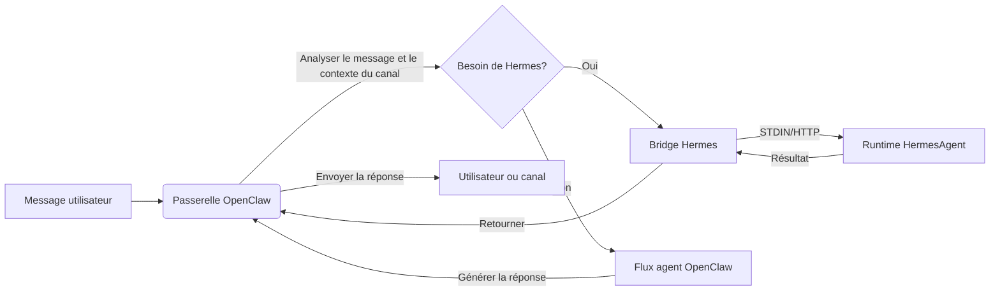

<p align="center">
  
</p>


<h1 align="center">HermesClaw</h1>

<p align="center">
  <strong>Un tableau de bord desktop pour OpenClaw, les agents Hermes, les canaux, les compétences et les flux de travail IA locaux</strong>
</p>

<p align="center">
  <a href="#présentation">Présentation</a> ·
  <a href="#pourquoi-hermesclaw-est-différent">Différences</a> ·
  <a href="#capacités-principales">Capacités</a> ·
  <a href="#démarrage-rapide">Démarrage Rapide</a> ·
  <a href="#développement">Développement</a>
</p>

<p align="center">
  <a href="README_CN.md">中文</a> · <a href="README_ES.md">Español</a> · <a href="README_HI.md">Hindi</a> · <a href="README_AR.md">العربية</a> · <a href="README_PT.md">Português</a> · Français · <a href="README_RU.md">Русский</a> · <a href="README_JA.md">日本語</a> · <a href="README_DE.md">Deutsch</a> · <a href="README.md">English</a>
</p>

<p align="center">
  
  
  
  
  
</p>

<p align="center">
  <a href="https://github.com/NextAgentX/HermesClaw">
    
  </a>
</p>

<p align="center">
  <b>Si HermesClaw vous a fait gagner du temps ou vous a inspiré, une ⭐ sur GitHub compte beaucoup — cela aide les autres à découvrir ce projet.</b>
</p>

---

## Présentation

HermesClaw est un espace de travail desktop open-source pour exécuter et gérer des agents IA. Il combine la passerelle OpenClaw, le runtime HermesAgent, la configuration des fournisseurs de modèles, les canaux, les compétences, les tâches, les journaux et la maintenance du runtime dans une seule application multiplateforme.

L'objectif n'est pas de construire un autre shell de chat. HermesClaw est conçu comme une console d'opérations d'agents locale : les utilisateurs obtiennent une interface graphique pour configurer et exploiter des flux de travail d'agents, tandis que les développeurs obtiennent une base de code TypeScript/Electron qui empaquette OpenClaw, HermesAgent, les miroirs de plugins, les compétences préinstallées et les flux de mise à jour desktop dans une application reproductible.

HermesClaw est utile lorsque vous souhaitez un desktop d'agents local capable de communiquer avec des fournisseurs de modèles, d'exécuter des compétences d'agents, de se connecter à de vrais canaux de messagerie et de maintenir le runtime sous-jacent visible et réparable.

## Pourquoi HermesClaw Est Différent

- **Tableau de bord runtime d'agents, pas seulement du chat** : HermesClaw expose les aspects pratiques de l'exécution des agents : état du runtime, clés de fournisseur, canaux, compétences, tâches planifiées, journaux, mises à jour, rollback et réparation.
- **OpenClaw + Hermes dans un seul flux desktop** : Le mode combiné par défaut permet à OpenClaw de gérer l'orchestration passerelle/canal tandis qu'HermesAgent est empaqueté comme une ressource runtime gérée.
- **Local-first et inspectable** : Les ressources runtime sont regroupées sur le disque, les journaux sont accessibles depuis l'interface et les Paramètres incluent des flux doctor/repair au lieu de masquer les échecs derrière une erreur générique.
- **Prêt pour les canaux par conception** : Les plugins de canaux OpenClaw tiers comme DingTalk, WeCom, Feishu/Lark et Weixin sont regroupés ou mis en miroir.
- **Flexibilité des fournisseurs de modèles** : Les utilisateurs peuvent configurer des clés API, des fournisseurs basés sur OAuth, l'autorisation GitHub Copilot et des endpoints personnalisés compatibles OpenAI depuis l'application desktop.
- **Packaging convivial pour les développeurs** : Les scripts de build préparent OpenClaw, HermesAgent, uv, les binaires Node, les compétences préinstallées, les bridges d'extension, les assets du programme d'installation et les ressources spécifiques à la plateforme pour le packaging Electron.

## Capacités Principales

- **Intégration graphique** : La configuration du premier lancement couvre la langue, le mode runtime, les fournisseurs de modèles et les compétences intégrées.
- **Espace de travail de chat d'agents** : Interface de conversation Markdown avec historique et routage `@agent` pour changer le contexte de l'agent.
- **Gestion du runtime** : Démarrer, arrêter, redémarrer, installer, mettre à jour, revenir en arrière, réparer et inspecter les composants runtime liés à OpenClaw et Hermes.
- **Gestion des fournisseurs** : Configurer les clés API, les identifiants OAuth, la sélection du fournisseur par défaut, les options de compatibilité, les URLs de base personnalisées compatibles OpenAI et l'autorisation GitHub Copilot.
- **Compétences et flux de marketplace** : Explorer, installer, activer et inspecter les compétences OpenClaw.
- **Canaux et comptes** : Gérer les plugins de canaux externes, les liaisons de comptes, les liaisons d'agents et la synchronisation du démarrage de canal.
- **Tâches planifiées** : Configurer des tâches récurrentes qui connectent les agents à des flux de travail réels plutôt qu'à des sessions de chat uniques.
- **Mises à jour desktop** : Les builds empaquetées utilisent GitHub Releases pour les mises à jour de l'application HermesClaw.
- **Shell d'application multiplateforme** : Architecture renderer/main Electron + React + TypeScript pour macOS, Windows et Linux.

## Cas d'Utilisation

- Exécuter OpenClaw/Hermes localement sans gérer chaque commande runtime manuellement.
- Configurer les fournisseurs de modèles et les identifiants via une interface desktop plutôt qu'en éditant des fichiers de configuration.
- Connecter les agents aux canaux de messagerie et maintenir les plugins de canal à jour dans les builds empaquetées.
- Inspecter et réparer l'état du runtime local lorsque la configuration de la passerelle, du plugin ou du modèle change.
- Développer, tester et empaqueter une distribution desktop d'agents complète autour d'OpenClaw et HermesAgent.

## Captures d'Écran

<p align="center">
  
</p>

<p align="center">
  
</p>

<p align="center">
  
</p>

<p align="center">
  
</p>

<p align="center">
  
</p>

<p align="center">
  
</p>

<p align="center">
  
</p>

<p align="center">
  
</p>

## Architecture du Runtime

HermesClaw comporte trois couches principales :

- **Renderer de l'App** : Interface React pour le chat, les paramètres, la configuration, les fournisseurs, les canaux, les compétences et les tâches.
- **Processus principal d'Electron** : Gère le cycle de vie de l'app, le bridge sécurisé IPC/API, la gestion des mises à jour, le registre d'extensions, la gestion de la passerelle et les services runtime.
- **Runtimes d'agents empaquetés** : Ressources de passerelle OpenClaw, runtime Python HermesAgent, miroirs de plugins OpenClaw, wrappers CLI, uv et binaires spécifiques à la plateforme.

Flux de données d'OpenClaw vers Hermes :



## Démarrage Rapide

### Environnement Runtime

- **Node.js** : Node.js 24 est recommandé pour correspondre à l'environnement CI.
- **Python** : Le packaging HermesAgent utilise Python 3.11.10 ; `pnpm run init` télécharge le runtime uv.
- **Gestionnaire de paquets** : Utilisez pnpm 10.31.0, verrouillé par le champ `packageManager` du projet.
- **Systèmes d'exploitation** : macOS, Windows et Linux sont pris en charge.
- **Ports** : Le serveur de développement utilise `5173` par défaut, et OpenClaw Gateway utilise `18789` par défaut.
- **Version d'OpenClaw** : La ligne de base empaquetée est fixée à `openclaw@2026.4.27`.

Clonez ce dépôt et exécutez les commandes suivantes dans le répertoire du projet :

```bash
cd HermesClaw
pnpm run init
pnpm dev
```

## Packaging

Construire un installateur Windows local :

```bash
pnpm run package:win
```

Construire d'autres plateformes :

```bash
pnpm run package:mac
pnpm run package:linux
```

## Développement

Commandes courantes :

```bash
pnpm install
pnpm run init
pnpm dev
pnpm run typecheck
pnpm run test
pnpm run build:vite
```

Structure du projet :

```text
HermesClaw/
├── electron/        # Processus principal Electron, services runtime, gestion de passerelle, preload
├── src/             # Application React renderer
├── resources/       # Ressources runtime, wrappers CLI, captures d'écran et assets empaquetés
├── scripts/         # Scripts de build, packaging, installateur et maintenance
├── shared/          # Constantes et types partagés entre les processus
└── tests/           # Tests unitaires et end-to-end
```

## Contribuer

Les issues, améliorations de documentation, traductions, corrections de bugs, tests, corrections de packaging et suggestions de fonctionnalités sont les bienvenus.

## Remerciements

HermesClaw a été rendu possible grâce à OpenClaw, HermesAgent et ClawX.

- **OpenClaw** : Fournit la passerelle d'agents et la base du runtime.
- **HermesAgent** : A inspiré l'intégration Hermes, la conception du runtime d'agents et la direction du bridge.
- **ClawX** : A fourni des références importantes pour la forme du produit desktop et l'expérience d'interaction.

## Licence

HermesClaw est open-source sous la [Licence MIT](LICENSE).

---

<p align="center">
  <b>HermesClaw vous a été utile ? Donnez-lui une ⭐ sur GitHub — cela aide le projet à grandir et à atteindre d'autres développeurs travaillant avec des agents IA locaux.</b><br/>
  <a href="https://github.com/NextAgentX/HermesClaw">⭐ Mettez une étoile à HermesClaw sur GitHub</a>
</p>
