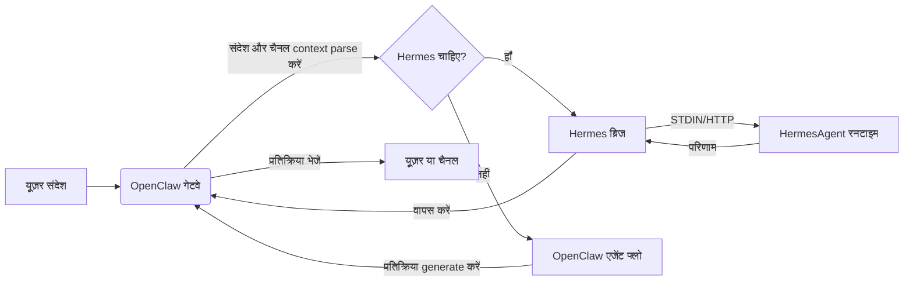

<p align="center">
  
</p>


<h1 align="center">HermesClaw</h1>

<p align="center">
  <strong>OpenClaw, Hermes एजेंट्स, चैनल्स, स्किल्स और लोकल AI वर्कफ्लो के लिए एक डेस्कटॉप कंट्रोल पैनल</strong>
</p>

<p align="center">
  <a href="#विवरण">विवरण</a> ·
  <a href="#hermesclaw-क्यों-अलग-है">अंतर</a> ·
  <a href="#मुख्य-क्षमताएं">क्षमताएं</a> ·
  <a href="#त्वरित-शुरुआत">त्वरित शुरुआत</a> ·
  <a href="#विकास">विकास</a>
</p>

<p align="center">
  <a href="README_CN.md">中文</a> · <a href="README_ES.md">Español</a> · Hindi · <a href="README_AR.md">العربية</a> · <a href="README_PT.md">Português</a> · <a href="README_FR.md">Français</a> · <a href="README_RU.md">Русский</a> · <a href="README_JA.md">日本語</a> · <a href="README_DE.md">Deutsch</a> · <a href="README.md">English</a>
</p>

<p align="center">
  
  
  
  
  
</p>

<p align="center">
  <a href="https://github.com/NextAgentX/HermesClaw">
    
  </a>
</p>

<p align="center">
  <b>अगर HermesClaw ने आपका समय बचाया या आपको प्रेरित किया, तो GitHub पर एक ⭐ बहुत मायने रखती है — इससे दूसरों को यह प्रोजेक्ट खोजने में मदद मिलती है।</b>
</p>

---

## विवरण

HermesClaw AI एजेंट्स को चलाने और प्रबंधित करने के लिए एक ओपन-सोर्स डेस्कटॉप वर्कस्पेस है। यह OpenClaw गेटवे, HermesAgent रनटाइम, मॉडल प्रोवाइडर कॉन्फ़िगरेशन, चैनल्स, स्किल्स, टास्क्स, लॉग्स और रनटाइम मेंटेनेंस को एक क्रॉस-प्लेटफॉर्म ऐप में एकत्रित करता है।

लक्ष्य केवल एक चैट शेल बनाना नहीं है। HermesClaw को एक लोकल एजेंट ऑपरेशन कंसोल के रूप में डिज़ाइन किया गया है: उपयोगकर्ताओं को एजेंट वर्कफ्लो को कॉन्फ़िगर और संचालित करने का ग्राफिकल तरीका मिलता है, जबकि डेवलपर्स को एक TypeScript/Electron कोड बेस मिलता है जो OpenClaw, HermesAgent, प्लगइन मिरर, प्री-इंस्टॉल्ड स्किल्स और डेस्कटॉप अपडेट फ्लो को एक reproducible ऐप में पैकेज करता है।

HermesClaw तब उपयोगी है जब आप एक लोकल एजेंट डेस्कटॉप चाहते हैं जो मॉडल प्रोवाइडर्स से communicate कर सके, एजेंट स्किल्स चला सके, वास्तविक मैसेजिंग चैनल्स से कनेक्ट हो सके और अंतर्निहित रनटाइम को visible और repairable रख सके।

## HermesClaw क्यों अलग है

- **सिर्फ चैट नहीं, एजेंट रनटाइम डैशबोर्ड**: HermesClaw एजेंट्स चलाने के व्यावहारिक हिस्सों को उजागर करता है: रनटाइम स्टेटस, प्रोवाइडर की, चैनल्स, स्किल्स, शेड्यूल्ड टास्क्स, लॉग्स, अपडेट, रोलबैक और रिपेयर।
- **एक ही डेस्कटॉप फ्लो में OpenClaw + Hermes**: डिफ़ॉल्ट कॉम्बाइन्ड मोड OpenClaw को गेटवे/चैनल ऑर्केस्ट्रेशन संभालने देता है जबकि HermesAgent को एक managed रनटाइम रिसोर्स के रूप में बंडल किया जाता है।
- **लोकल-फर्स्ट और इंस्पेक्टेबल**: रनटाइम रिसोर्स डिस्क पर बंडल होते हैं, लॉग्स UI से accessible हैं और Settings में एक generic error के पीछे failure छुपाने की बजाय doctor/repair फ्लो शामिल हैं।
- **चैनल-रेडी बाय डिज़ाइन**: DingTalk, WeCom, Feishu/Lark और Weixin जैसे थर्ड-पार्टी OpenClaw चैनल प्लगइन बंडल या मिरर किए जाते हैं।
- **मॉडल प्रोवाइडर फ्लेक्सिबिलिटी**: यूज़र डेस्कटॉप ऐप से API कीज़, OAuth-based प्रोवाइडर, GitHub Copilot ऑथराइज़ेशन और कस्टम OpenAI-compatible endpoints कॉन्फ़िगर कर सकते हैं।
- **डेवलपर-फ्रेंडली पैकेजिंग**: बिल्ड स्क्रिप्ट्स OpenClaw, HermesAgent, uv, Node बाइनरी, प्री-इंस्टॉल्ड स्किल्स, एक्सटेंशन ब्रिज, इंस्टॉलर एसेट्स और प्लेटफॉर्म-स्पेसिफिक रिसोर्स Electron पैकेजिंग के लिए तैयार करती हैं।

## मुख्य क्षमताएं

- **ग्राफिकल ऑनबोर्डिंग**: पहली बार उपयोग का सेटअप भाषा, रनटाइम मोड, मॉडल प्रोवाइडर और बिल्ट-इन स्किल्स को कवर करता है।
- **एजेंट चैट वर्कस्पेस**: Markdown conversation इंटरफ़ेस जिसमें इतिहास और एजेंट context स्विच करने के लिए `@agent` रूटिंग है।
- **रनटाइम मैनेजमेंट**: OpenClaw और Hermes-related रनटाइम कॉम्पोनेंट को start, stop, restart, install, update, rollback, repair और inspect करें।
- **प्रोवाइडर मैनेजमेंट**: API कीज़, OAuth credentials, डिफ़ॉल्ट प्रोवाइडर सिलेक्शन, compatibility options, कस्टम OpenAI-compatible बेस URLs और GitHub Copilot authorization कॉन्फ़िगर करें।
- **स्किल्स और मार्केटप्लेस फ्लो**: OpenClaw स्किल्स explore, install, enable और inspect करें।
- **चैनल्स और अकाउंट्स**: बाहरी चैनल प्लगइन, अकाउंट बाइंडिंग, एजेंट बाइंडिंग और चैनल startup sync मैनेज करें।
- **शेड्यूल्ड टास्क्स**: Recurring जॉब्स कॉन्फ़िगर करें जो एजेंट्स को single chat sessions की बजाय वास्तविक वर्कफ्लो से जोड़ते हैं।
- **डेस्कटॉप अपडेट्स**: पैकेज्ड बिल्ड GitHub Releases का उपयोग HermesClaw app अपडेट के लिए करते हैं।
- **क्रॉस-प्लेटफॉर्म ऐप शेल**: macOS, Windows और Linux के लिए Electron + React + TypeScript renderer/main आर्किटेक्चर।

## उपयोग के मामले

- हर रनटाइम कमांड मैन्युअली मैनेज किए बिना OpenClaw/Hermes को लोकल रूप से चलाना।
- कॉन्फ़िगरेशन फाइल्स एडिट करने की बजाय डेस्कटॉप UI के माध्यम से मॉडल प्रोवाइडर और credentials कॉन्फ़िगर करना।
- एजेंट्स को मैसेजिंग चैनल्स से कनेक्ट करना और पैकेज्ड बिल्ड में चैनल प्लगइन को अपडेट रखना।
- जब gateway, plugin या model configuration बदले तो लोकल रनटाइम स्टेट inspect और repair करना।
- OpenClaw और HermesAgent के इर्द-गिर्द एक पूर्ण एजेंट डेस्कटॉप डिस्ट्रीब्यूशन develop, test और package करना।

## स्क्रीनशॉट

<p align="center">
  
</p>

<p align="center">
  
</p>

<p align="center">
  
</p>

<p align="center">
  
</p>

<p align="center">
  
</p>

<p align="center">
  
</p>

<p align="center">
  
</p>

<p align="center">
  
</p>

## रनटाइम आर्किटेक्चर

HermesClaw की तीन मुख्य परतें हैं:

- **ऐप रेंडरर**: चैट, सेटिंग्स, सेटअप, प्रोवाइडर, चैनल, स्किल्स और टास्क्स के लिए React UI।
- **Electron मुख्य प्रक्रिया**: ऐप lifecycle, सुरक्षित IPC/API ब्रिज, अपडेट हैंडलिंग, एक्सटेंशन रजिस्ट्री, गेटवे मैनेजमेंट और रनटाइम सर्विसेज मैनेज करता है।
- **बंडल्ड एजेंट रनटाइम**: OpenClaw गेटवे रिसोर्स, HermesAgent Python रनटाइम, OpenClaw प्लगइन मिरर, CLI wrappers, uv और प्लेटफॉर्म-स्पेसिफिक बाइनरी।

OpenClaw से Hermes तक डेटा फ्लो:



## त्वरित शुरुआत

### रनटाइम वातावरण

- **Node.js**: CI वातावरण के साथ मेल के लिए Node.js 24 अनुशंसित है।
- **Python**: HermesAgent पैकेजिंग Python 3.11.10 उपयोग करती है; `pnpm run init` uv रनटाइम डाउनलोड करता है।
- **पैकेज मैनेजर**: pnpm 10.31.0 उपयोग करें, प्रोजेक्ट के `packageManager` फील्ड द्वारा लॉक किया गया।
- **ऑपरेटिंग सिस्टम**: macOS, Windows और Linux समर्थित हैं।
- **पोर्ट्स**: Dev server डिफ़ॉल्ट रूप से `5173` उपयोग करता है, OpenClaw Gateway `18789` डिफ़ॉल्ट रूप से।
- **OpenClaw वर्शन**: बंडल्ड बेसलाइन `openclaw@2026.4.27` पर pinned है।

इस रिपॉजिटरी को क्लोन करें और प्रोजेक्ट डायरेक्टरी में निम्नलिखित कमांड चलाएं:

```bash
cd HermesClaw
pnpm run init
pnpm dev
```

## पैकेजिंग

एक लोकल Windows इंस्टॉलर बनाएं:

```bash
pnpm run package:win
```

अन्य प्लेटफॉर्म बनाएं:

```bash
pnpm run package:mac
pnpm run package:linux
```

## विकास

सामान्य कमांड:

```bash
pnpm install
pnpm run init
pnpm dev
pnpm run typecheck
pnpm run test
pnpm run build:vite
```

प्रोजेक्ट संरचना:

```text
HermesClaw/
├── electron/        # Electron मुख्य प्रक्रिया, रनटाइम सर्विसेज, गेटवे मैनेजमेंट, preload
├── src/             # React renderer ऐप
├── resources/       # रनटाइम रिसोर्स, CLI wrappers, स्क्रीनशॉट और बंडल्ड एसेट
├── scripts/         # बिल्ड, पैकेजिंग, इंस्टॉलर और मेंटेनेंस स्क्रिप्ट
├── shared/          # प्रक्रियाओं के बीच shared constants और types
└── tests/           # यूनिट और end-to-end टेस्ट
```

## योगदान करें

Issues, documentation improvements, translations, bug fixes, tests, packaging fixes और feature suggestions स्वागत हैं।

## आभार

HermesClaw OpenClaw, HermesAgent और ClawX द्वारा संभव हुआ।

- **OpenClaw**: एजेंट गेटवे और रनटाइम foundation प्रदान करता है।
- **HermesAgent**: Hermes integration, एजेंट रनटाइम डिज़ाइन और bridge direction के लिए प्रेरणा।
- **ClawX**: डेस्कटॉप प्रोडक्ट शेप और interaction experience के लिए महत्वपूर्ण संदर्भ।

## लाइसेंस

HermesClaw [MIT लाइसेंस](LICENSE) के तहत ओपन-सोर्स है।

---

<p align="center">
  <b>क्या HermesClaw उपयोगी लगा? GitHub पर एक ⭐ दें — इससे प्रोजेक्ट बढ़ता है और लोकल AI एजेंट्स के साथ काम करने वाले अन्य डेवलपर्स तक पहुंचता है।</b><br/>
  <a href="https://github.com/NextAgentX/HermesClaw">⭐ GitHub पर HermesClaw को Star करें</a>
</p>
