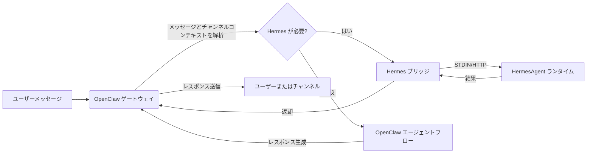

<p align="center">
  
</p>


<h1 align="center">HermesClaw</h1>

<p align="center">
  <strong>OpenClaw、Hermesエージェント、チャンネル、スキル、ローカルAIワークフローのためのデスクトップコントロールパネル</strong>
</p>

<p align="center">
  <a href="#概要">概要</a> ·
  <a href="#hermesclawが違う理由">違い</a> ·
  <a href="#主な機能">主な機能</a> ·
  <a href="#クイックスタート">クイックスタート</a> ·
  <a href="#開発">開発</a>
</p>

<p align="center">
  <a href="README_CN.md">中文</a> · <a href="README_ES.md">Español</a> · <a href="README_HI.md">Hindi</a> · <a href="README_AR.md">العربية</a> · <a href="README_PT.md">Português</a> · <a href="README_FR.md">Français</a> · <a href="README_RU.md">Русский</a> · 日本語 · <a href="README_DE.md">Deutsch</a> · <a href="README.md">English</a>
</p>

<p align="center">
  
  
  
  
  
</p>

<p align="center">
  <a href="https://github.com/NextAgentX/HermesClaw">
    
  </a>
</p>

<p align="center">
  <b>HermesClaw が時間の節約やインスピレーションになったなら、GitHub の ⭐ は大きな意味を持ちます — 他の方がこのプロジェクトを見つける助けになります。</b>
</p>

---

## 概要

HermesClaw は、AIエージェントを実行・管理するためのオープンソースデスクトップワークスペースです。OpenClaw ゲートウェイ、HermesAgent ランタイム、モデルプロバイダーの設定、チャンネル、スキル、タスク、ログ、ランタイムのメンテナンスを一つのクロスプラットフォームアプリにまとめています。

目標は単なるチャットシェルを作ることではありません。HermesClaw はローカルエージェント運用コンソールとして設計されています。ユーザーはエージェントワークフローをグラフィカルに設定・操作でき、開発者は OpenClaw、HermesAgent、プラグインミラー、プリインストールされたスキル、デスクトップアップデートフローを再現可能なアプリにパッケージする TypeScript/Electron コードベースを得られます。

HermesClaw は、モデルプロバイダーと通信し、エージェントスキルを実行し、実際のメッセージングチャンネルに接続し、基盤となるランタイムを可視化・修復可能な状態に保つローカルエージェントデスクトップが必要な場合に役立ちます。

## HermesClaw が違う理由

- **チャットだけでなく、エージェントランタイムダッシュボード**: HermesClaw はエージェント運用の実践的な部分を公開します: ランタイムステータス、プロバイダーキー、チャンネル、スキル、スケジュールされたタスク、ログ、更新、ロールバック、修復。
- **一つのデスクトップフローで OpenClaw + Hermes**: デフォルトの結合モードにより OpenClaw がゲートウェイ/チャンネルのオーケストレーションを担当し、HermesAgent は管理されたランタイムリソースとしてバンドルされます。
- **ローカルファーストで検査可能**: ランタイムリソースはディスクにバンドルされ、ログはUIからアクセスでき、設定には汎用エラーの裏に障害を隠す代わりに doctor/repair フローが含まれます。
- **設計によってチャンネル対応**: DingTalk、WeCom、Feishu/Lark、Weixin などのサードパーティ OpenClaw チャンネルプラグインがバンドルまたはミラーされます。
- **モデルプロバイダーの柔軟性**: ユーザーはデスクトップアプリから API キー、OAuth ベースのプロバイダー、GitHub Copilot 認証、カスタム OpenAI 互換エンドポイントを設定できます。
- **開発者フレンドリーなパッケージング**: ビルドスクリプトが Electron パッケージング用に OpenClaw、HermesAgent、uv、Node バイナリ、プリインストールスキル、拡張ブリッジ、インストーラーアセット、プラットフォーム固有リソースを準備します。

## 主な機能

- **グラフィカルなオンボーディング**: 初回使用セットアップで言語、ランタイムモード、モデルプロバイダー、組み込みスキルをカバー。
- **エージェントチャットワークスペース**: 履歴と `@agent` ルーティングによるエージェントコンテキスト切り替えを備えた Markdown 会話インターフェース。
- **ランタイム管理**: OpenClaw および Hermes 関連のランタイムコンポーネントを起動、停止、再起動、インストール、更新、ロールバック、修復、検査。
- **プロバイダー管理**: API キー、OAuth 認証情報、デフォルトプロバイダー選択、互換性オプション、カスタム OpenAI 互換ベース URL、GitHub Copilot 認証を設定。
- **スキルとマーケットプレイスフロー**: OpenClaw スキルを探索、インストール、有効化、検査。
- **チャンネルとアカウント**: 外部チャンネルプラグイン、アカウントバインディング、エージェントバインディング、チャンネル起動同期を管理。
- **スケジュールされたタスク**: 単一チャットセッションではなく、実際のワークフローにエージェントを接続する定期ジョブを設定。
- **デスクトップ更新**: パッケージされたビルドは HermesClaw アプリの更新に GitHub Releases を使用。
- **クロスプラットフォームアプリシェル**: macOS、Windows、Linux 向けの Electron + React + TypeScript renderer/main アーキテクチャ。

## ユースケース

- 各ランタイムコマンドを手動で管理せずに OpenClaw/Hermes をローカルで実行する。
- 設定ファイルを編集する代わりに、デスクトップ UI でモデルプロバイダーと認証情報を設定する。
- エージェントをメッセージングチャンネルに接続し、パッケージされたビルドでチャンネルプラグインを最新の状態に保つ。
- ゲートウェイ、プラグイン、またはモデル設定が変更されたときにローカルランタイム状態を検査・修復する。
- OpenClaw と HermesAgent を中心に完全なエージェントデスクトップディストリビューションを開発、テスト、パッケージする。

## スクリーンショット

<p align="center">
  
</p>

<p align="center">
  
</p>

<p align="center">
  
</p>

<p align="center">
  
</p>

<p align="center">
  
</p>

<p align="center">
  
</p>

<p align="center">
  
</p>

<p align="center">
  
</p>

## ランタイムアーキテクチャ

HermesClaw には三つの主要レイヤーがあります:

- **アプリレンダラー**: チャット、設定、セットアップ、プロバイダー、チャンネル、スキル、タスク用の React UI。
- **Electron メインプロセス**: アプリのライフサイクル、セキュアな IPC/API ブリッジ、更新処理、拡張レジストリ、ゲートウェイ管理、ランタイムサービスを管理。
- **バンドルされたエージェントランタイム**: OpenClaw ゲートウェイリソース、HermesAgent Python ランタイム、OpenClaw プラグインミラー、CLI ラッパー、uv、プラットフォーム固有バイナリ。

OpenClaw から Hermes へのデータフロー:



## クイックスタート

### ランタイム環境

- **Node.js**: CI 環境との一致のため Node.js 24 を推奨。
- **Python**: HermesAgent パッケージングは Python 3.11.10 を使用; `pnpm run init` が uv ランタイムをダウンロード。
- **パッケージマネージャー**: プロジェクトの `packageManager` フィールドでロックされた pnpm 10.31.0 を使用。
- **OS**: macOS、Windows、Linux をサポート。
- **ポート**: 開発サーバーはデフォルト `5173`、OpenClaw Gateway はデフォルト `18789`。
- **OpenClaw バージョン**: バンドルされたベースラインは `openclaw@2026.4.27` に固定。

このリポジトリをクローンし、プロジェクトディレクトリで以下のコマンドを実行:

```bash
cd HermesClaw
pnpm run init
pnpm dev
```

## パッケージング

ローカル Windows インストーラーのビルド:

```bash
pnpm run package:win
```

その他のプラットフォーム:

```bash
pnpm run package:mac
pnpm run package:linux
```

## 開発

一般的なコマンド:

```bash
pnpm install
pnpm run init
pnpm dev
pnpm run typecheck
pnpm run test
pnpm run build:vite
```

プロジェクト構造:

```text
HermesClaw/
├── electron/        # Electron メインプロセス、ランタイムサービス、ゲートウェイ管理、preload
├── src/             # React renderer アプリ
├── resources/       # ランタイムリソース、CLI ラッパー、スクリーンショット、バンドルアセット
├── scripts/         # ビルド、パッケージング、インストーラー、メンテナンスのスクリプト
├── shared/          # プロセス間で共有する定数と型
└── tests/           # ユニットテストと E2E テスト
```

## コントリビュート

Issue、ドキュメントの改善、翻訳、バグ修正、テスト、パッケージング修正、機能提案を歓迎します。

## 謝辞

HermesClaw は OpenClaw、HermesAgent、ClawX のおかげで実現しました。

- **OpenClaw**: エージェントゲートウェイとランタイム基盤を提供。
- **HermesAgent**: Hermes 統合、エージェントランタイム設計、ブリッジの方向性にインスピレーションを与えた。
- **ClawX**: デスクトッププロダクトの形とインタラクション体験について重要な参考を提供。

## ライセンス

HermesClaw は [MIT ライセンス](LICENSE) のオープンソースです。

---

<p align="center">
  <b>HermesClaw が役に立ちましたか? GitHub で ⭐ をつけてください — プロジェクトの成長を助け、ローカル AI エージェントを扱う他の開発者に届けることができます。</b><br/>
  <a href="https://github.com/NextAgentX/HermesClaw">⭐ GitHub で HermesClaw にスターをつける</a>
</p>
