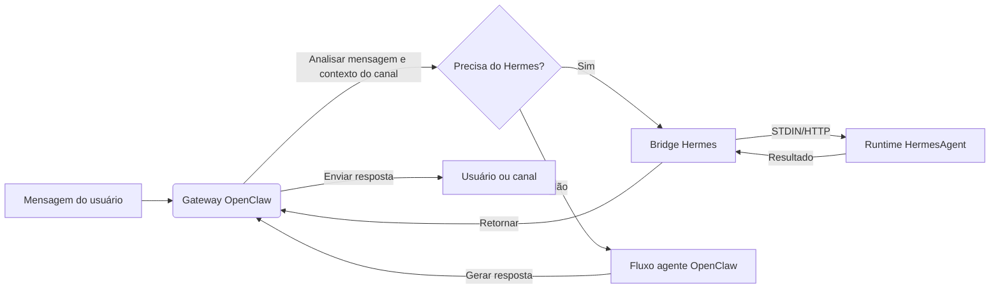

<p align="center">
  
</p>


<h1 align="center">HermesClaw</h1>

<p align="center">
  <strong>Um painel de controle desktop para OpenClaw, agentes Hermes, canais, habilidades e fluxos de trabalho de IA local</strong>
</p>

<p align="center">
  <a href="#visão-geral">Visão Geral</a> ·
  <a href="#por-que-o-hermesclaw-é-diferente">Diferenciais</a> ·
  <a href="#capacidades-principais">Capacidades</a> ·
  <a href="#início-rápido">Início Rápido</a> ·
  <a href="#desenvolvimento">Desenvolvimento</a>
</p>

<p align="center">
  <a href="README_CN.md">中文</a> · <a href="README_ES.md">Español</a> · <a href="README_HI.md">Hindi</a> · <a href="README_AR.md">العربية</a> · Português · <a href="README_FR.md">Français</a> · <a href="README_RU.md">Русский</a> · <a href="README_JA.md">日本語</a> · <a href="README_DE.md">Deutsch</a> · <a href="README.md">English</a>
</p>

<p align="center">
  
  
  
  
  
</p>

<p align="center">
  <a href="https://github.com/NextAgentX/HermesClaw">
    
  </a>
</p>

<p align="center">
  <b>Se o HermesClaw economizou seu tempo ou inspirou você, uma ⭐ no GitHub significa muito — ajuda outros a descobrirem este projeto.</b>
</p>

---

## Visão Geral

HermesClaw é um espaço de trabalho desktop de código aberto para executar e gerenciar agentes de IA. Combina o gateway OpenClaw, o runtime HermesAgent, configuração de provedores de modelos, canais, habilidades, tarefas, logs e manutenção do runtime em um único aplicativo multiplataforma.

O objetivo não é construir mais um shell de chat. O HermesClaw é projetado como um console de operações de agentes local: os usuários obtêm uma forma gráfica de configurar e operar fluxos de trabalho de agentes, enquanto os desenvolvedores obtêm uma base de código TypeScript/Electron que empacota OpenClaw, HermesAgent, espelhos de plugins, habilidades pré-instaladas e fluxos de atualização desktop em um aplicativo reproduzível.

HermesClaw é útil quando você quer um desktop de agentes local que possa se comunicar com provedores de modelos, executar habilidades de agentes, conectar a canais de mensagens reais e manter o runtime subjacente visível e reparável.

## Por Que o HermesClaw É Diferente

- **Painel de runtime de agentes, não apenas chat**: O HermesClaw expõe as partes práticas de executar agentes: status do runtime, chaves de provedor, canais, habilidades, tarefas agendadas, logs, atualizações, rollback e reparo.
- **OpenClaw + Hermes em um único fluxo desktop**: O modo combinado padrão permite que o OpenClaw lide com a orquestração gateway/canal enquanto o HermesAgent é empacotado como um recurso de runtime gerenciado.
- **Local-first e inspecionável**: Os recursos do runtime são agrupados em disco, os logs são acessíveis a partir da interface e as Configurações incluem fluxos de doctor/repair em vez de ocultar falhas atrás de um erro genérico.
- **Pronto para canais por design**: Plugins de canais OpenClaw de terceiros como DingTalk, WeCom, Feishu/Lark e Weixin são agrupados ou espelhados.
- **Flexibilidade de provedor de modelos**: Os usuários podem configurar chaves de API, provedores baseados em OAuth, autorização GitHub Copilot e endpoints personalizados compatíveis com OpenAI a partir do aplicativo desktop.
- **Empacotamento amigável para desenvolvedores**: Os scripts de build preparam OpenClaw, HermesAgent, uv, binários Node, habilidades pré-instaladas, bridges de extensão, assets do instalador e recursos específicos de plataforma para empacotamento Electron.

## Capacidades Principais

- **Integração gráfica**: A configuração do primeiro uso abrange idioma, modo de runtime, provedores de modelos e habilidades integradas.
- **Espaço de trabalho de chat de agentes**: Interface de conversa Markdown com histórico e roteamento `@agent` para alternar o contexto do agente.
- **Gerenciamento de runtime**: Iniciar, parar, reiniciar, instalar, atualizar, reverter, reparar e inspecionar componentes de runtime relacionados a OpenClaw e Hermes.
- **Gerenciamento de provedores**: Configurar chaves de API, credenciais OAuth, seleção de provedor padrão, opções de compatibilidade, URLs base personalizadas compatíveis com OpenAI e autorização GitHub Copilot.
- **Habilidades e fluxos do marketplace**: Explorar, instalar, habilitar e inspecionar habilidades do OpenClaw.
- **Canais e contas**: Gerenciar plugins de canais externos, vinculações de contas, vinculações de agentes e sincronização de inicialização de canal.
- **Tarefas agendadas**: Configurar trabalhos recorrentes que conectam agentes a fluxos de trabalho reais em vez de sessões de chat únicas.
- **Atualizações desktop**: As builds empacotadas usam GitHub Releases para atualizações do aplicativo HermesClaw.
- **Shell de aplicativo multiplataforma**: Arquitetura renderer/main Electron + React + TypeScript para macOS, Windows e Linux.

## Casos de Uso

- Executar OpenClaw/Hermes localmente sem gerenciar cada comando de runtime manualmente.
- Configurar provedores de modelos e credenciais através de uma interface desktop em vez de editar arquivos de configuração.
- Conectar agentes a canais de mensagens e manter plugins de canal atualizados em builds empacotadas.
- Inspecionar e reparar o estado do runtime local quando a configuração de gateway, plugin ou modelo muda.
- Desenvolver, testar e empacotar uma distribuição desktop de agentes completa em torno de OpenClaw e HermesAgent.

## Capturas de Tela

<p align="center">
  
</p>

<p align="center">
  
</p>

<p align="center">
  
</p>

<p align="center">
  
</p>

<p align="center">
  
</p>

<p align="center">
  
</p>

<p align="center">
  
</p>

<p align="center">
  
</p>

## Arquitetura do Runtime

O HermesClaw tem três camadas principais:

- **Renderer do App**: Interface React para chat, configurações, setup, provedores, canais, habilidades e tarefas.
- **Processo principal do Electron**: Gerencia o ciclo de vida do app, bridge segura IPC/API, manipulação de atualizações, registro de extensões, gerenciamento de gateway e serviços de runtime.
- **Runtimes de agentes empacotados**: Recursos do gateway OpenClaw, runtime Python do HermesAgent, espelhos de plugins OpenClaw, wrappers CLI, uv e binários específicos de plataforma.

Fluxo de dados do OpenClaw para o Hermes:



## Início Rápido

### Ambiente de Runtime

- **Node.js**: Node.js 24 é recomendado para corresponder ao ambiente CI.
- **Python**: O empacotamento do HermesAgent usa Python 3.11.10; `pnpm run init` baixa o runtime uv.
- **Gerenciador de pacotes**: Use pnpm 10.31.0, bloqueado pelo campo `packageManager` do projeto.
- **Sistemas operacionais**: macOS, Windows e Linux são suportados.
- **Portas**: O servidor de desenvolvimento usa `5173` por padrão, e o OpenClaw Gateway usa `18789` por padrão.
- **Versão do OpenClaw**: A linha de base empacotada está fixada em `openclaw@2026.4.27`.

Clone este repositório e execute os seguintes comandos no diretório do projeto:

```bash
cd HermesClaw
pnpm run init
pnpm dev
```

## Empacotamento

Construir um instalador local do Windows:

```bash
pnpm run package:win
```

Construir outras plataformas:

```bash
pnpm run package:mac
pnpm run package:linux
```

## Desenvolvimento

Comandos comuns:

```bash
pnpm install
pnpm run init
pnpm dev
pnpm run typecheck
pnpm run test
pnpm run build:vite
```

Estrutura do projeto:

```text
HermesClaw/
├── electron/        # Processo principal do Electron, serviços de runtime, gerenciamento de gateway, preload
├── src/             # Aplicativo React renderer
├── resources/       # Recursos de runtime, wrappers CLI, capturas de tela e assets empacotados
├── scripts/         # Scripts de build, empacotamento, instalador e manutenção
├── shared/          # Constantes e tipos compartilhados entre processos
└── tests/           # Testes unitários e end-to-end
```

## Contribuindo

Issues, melhorias de documentação, traduções, correções de bugs, testes, correções de empacotamento e sugestões de funcionalidades são bem-vindos.

## Agradecimentos

O HermesClaw foi possível graças a OpenClaw, HermesAgent e ClawX.

- **OpenClaw**: Fornece o gateway de agentes e a base do runtime.
- **HermesAgent**: Inspirou a integração Hermes, o design do runtime de agentes e a direção da bridge.
- **ClawX**: Forneceu referências importantes para a forma do produto desktop e a experiência de interação.

## Licença

O HermesClaw é de código aberto sob a [Licença MIT](LICENSE).

---

<p align="center">
  <b>O HermesClaw foi útil para você? Dê uma ⭐ no GitHub — isso ajuda o projeto a crescer e alcançar outros desenvolvedores que trabalham com agentes de IA locais.</b><br/>
  <a href="https://github.com/NextAgentX/HermesClaw">⭐ Dê uma estrela ao HermesClaw no GitHub</a>
</p>
