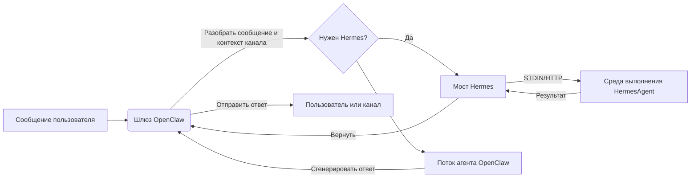

<p align="center">
  
</p>


<h1 align="center">HermesClaw</h1>

<p align="center">
  <strong>Панель управления рабочего стола для OpenClaw, агентов Hermes, каналов, навыков и локальных AI-рабочих процессов</strong>
</p>

<p align="center">
  <a href="#обзор">Обзор</a> ·
  <a href="#чем-отличается-hermesclaw">Отличия</a> ·
  <a href="#основные-возможности">Возможности</a> ·
  <a href="#быстрый-старт">Быстрый старт</a> ·
  <a href="#разработка">Разработка</a>
</p>

<p align="center">
  <a href="README_CN.md">中文</a> · <a href="README_ES.md">Español</a> · <a href="README_HI.md">Hindi</a> · <a href="README_AR.md">العربية</a> · <a href="README_PT.md">Português</a> · <a href="README_FR.md">Français</a> · Русский · <a href="README_JA.md">日本語</a> · <a href="README_DE.md">Deutsch</a> · <a href="README.md">English</a>
</p>

<p align="center">
  
  
  
  
  
</p>

<p align="center">
  <a href="https://github.com/NextAgentX/HermesClaw">
    
  </a>
</p>

<p align="center">
  <b>Если HermesClaw сэкономил вам время или вдохновил вас, ⭐ на GitHub много значит — это помогает другим найти проект.</b>
</p>

---

## Обзор

HermesClaw — это рабочее пространство с открытым исходным кодом для запуска и управления AI-агентами. Он объединяет шлюз OpenClaw, среду выполнения HermesAgent, настройку провайдеров моделей, каналы, навыки, задачи, журналы и обслуживание среды выполнения в одном кроссплатформенном приложении.

Цель — не создать ещё один чат-шелл. HermesClaw спроектирован как локальная консоль управления агентами: пользователи получают графический интерфейс для настройки и управления рабочими процессами агентов, а разработчики — кодовую базу TypeScript/Electron, которая упаковывает OpenClaw, HermesAgent, зеркала плагинов, предустановленные навыки и потоки обновления рабочего стола в воспроизводимое приложение.

HermesClaw полезен, когда вам нужен локальный рабочий стол агентов, который может общаться с провайдерами моделей, запускать навыки агентов, подключаться к реальным каналам обмена сообщениями и поддерживать базовую среду выполнения видимой и пригодной для ремонта.

## Чем Отличается HermesClaw

- **Панель управления средой выполнения агентов, а не просто чат**: HermesClaw раскрывает практические аспекты работы агентов: статус среды выполнения, ключи провайдеров, каналы, навыки, запланированные задачи, журналы, обновления, откат и ремонт.
- **OpenClaw + Hermes в едином потоке рабочего стола**: Режим совмещения по умолчанию позволяет OpenClaw управлять оркестрацией шлюза/канала, а HermesAgent упаковывается как управляемый ресурс среды выполнения.
- **Local-first и инспектируемый**: Ресурсы среды выполнения хранятся на диске, журналы доступны из интерфейса, а в настройках предусмотрены потоки doctor/repair вместо скрытия сбоев за общей ошибкой.
- **Готов к каналам по замыслу**: Сторонние плагины каналов OpenClaw, такие как DingTalk, WeCom, Feishu/Lark и Weixin, упакованы или зеркалированы.
- **Гибкость провайдеров моделей**: Пользователи могут настраивать ключи API, провайдеров на основе OAuth, авторизацию GitHub Copilot и пользовательские конечные точки, совместимые с OpenAI, прямо из приложения.
- **Удобная для разработчиков упаковка**: Скрипты сборки подготавливают OpenClaw, HermesAgent, uv, бинарные файлы Node, предустановленные навыки, мосты расширений, ресурсы установщика и платформо-специфичные ресурсы для упаковки Electron.

## Основные Возможности

- **Графическая интеграция**: Начальная настройка охватывает язык, режим среды выполнения, провайдеров моделей и встроенные навыки.
- **Рабочее пространство чата агентов**: Интерфейс беседы Markdown с историей и маршрутизацией `@agent` для переключения контекста агента.
- **Управление средой выполнения**: Запускать, останавливать, перезапускать, устанавливать, обновлять, откатывать, ремонтировать и инспектировать компоненты среды выполнения, связанные с OpenClaw и Hermes.
- **Управление провайдерами**: Настраивать ключи API, учётные данные OAuth, выбор провайдера по умолчанию, параметры совместимости, пользовательские базовые URL, совместимые с OpenAI, и авторизацию GitHub Copilot.
- **Навыки и потоки маркетплейса**: Исследовать, устанавливать, включать и инспектировать навыки OpenClaw.
- **Каналы и аккаунты**: Управлять внешними плагинами каналов, привязками аккаунтов, привязками агентов и синхронизацией запуска канала.
- **Запланированные задачи**: Настраивать повторяющиеся задания, которые связывают агентов с реальными рабочими процессами вместо одноразовых чат-сессий.
- **Обновления рабочего стола**: Упакованные сборки используют GitHub Releases для обновлений приложения HermesClaw.
- **Кроссплатформенная оболочка приложения**: Архитектура renderer/main Electron + React + TypeScript для macOS, Windows и Linux.

## Сценарии Использования

- Запускать OpenClaw/Hermes локально без управления каждой командой среды выполнения вручную.
- Настраивать провайдеров моделей и учётные данные через интерфейс рабочего стола вместо редактирования файлов конфигурации.
- Подключать агентов к каналам обмена сообщениями и поддерживать актуальность плагинов каналов в упакованных сборках.
- Инспектировать и ремонтировать локальное состояние среды выполнения при изменении конфигурации шлюза, плагина или модели.
- Разрабатывать, тестировать и упаковывать полный дистрибутив рабочего стола агентов на основе OpenClaw и HermesAgent.

## Скриншоты

<p align="center">
  
</p>

<p align="center">
  
</p>

<p align="center">
  
</p>

<p align="center">
  
</p>

<p align="center">
  
</p>

<p align="center">
  
</p>

<p align="center">
  
</p>

<p align="center">
  
</p>

## Архитектура Среды Выполнения

HermesClaw имеет три основных слоя:

- **Рендерер приложения**: Интерфейс React для чата, настроек, установки, провайдеров, каналов, навыков и задач.
- **Основной процесс Electron**: Управляет жизненным циклом приложения, безопасным мостом IPC/API, обработкой обновлений, реестром расширений, управлением шлюзом и службами среды выполнения.
- **Упакованные среды выполнения агентов**: Ресурсы шлюза OpenClaw, среда выполнения Python HermesAgent, зеркала плагинов OpenClaw, обёртки CLI, uv и платформо-специфичные бинарные файлы.

Поток данных от OpenClaw к Hermes:



## Быстрый Старт

### Среда Выполнения

- **Node.js**: Рекомендуется Node.js 24 для соответствия среде CI.
- **Python**: Упаковка HermesAgent использует Python 3.11.10; `pnpm run init` загружает среду выполнения uv.
- **Менеджер пакетов**: Используйте pnpm 10.31.0, заблокированный полем `packageManager` проекта.
- **Операционные системы**: Поддерживаются macOS, Windows и Linux.
- **Порты**: Сервер разработки по умолчанию использует `5173`, шлюз OpenClaw — `18789`.
- **Версия OpenClaw**: Базовая упакованная версия закреплена на `openclaw@2026.4.27`.

Клонируйте этот репозиторий и выполните следующие команды в директории проекта:

```bash
cd HermesClaw
pnpm run init
pnpm dev
```

## Упаковка

Собрать локальный установщик Windows:

```bash
pnpm run package:win
```

Собрать другие платформы:

```bash
pnpm run package:mac
pnpm run package:linux
```

## Разработка

Общие команды:

```bash
pnpm install
pnpm run init
pnpm dev
pnpm run typecheck
pnpm run test
pnpm run build:vite
```

Структура проекта:

```text
HermesClaw/
├── electron/        # Основной процесс Electron, службы среды выполнения, управление шлюзом, preload
├── src/             # Приложение React renderer
├── resources/       # Ресурсы среды выполнения, обёртки CLI, скриншоты и упакованные ресурсы
├── scripts/         # Скрипты сборки, упаковки, установщика и обслуживания
├── shared/          # Общие константы и типы между процессами
└── tests/           # Модульные и сквозные тесты
```

## Участие в Разработке

Приветствуются задачи, улучшения документации, переводы, исправления ошибок, тесты, исправления упаковки и предложения функций.

## Благодарности

HermesClaw стал возможным благодаря OpenClaw, HermesAgent и ClawX.

- **OpenClaw**: Предоставляет шлюз агентов и основу среды выполнения.
- **HermesAgent**: Вдохновил интеграцию Hermes, дизайн среды выполнения агентов и направление моста.
- **ClawX**: Предоставил важные ориентиры для формы продукта рабочего стола и опыта взаимодействия.

## Лицензия

HermesClaw является проектом с открытым исходным кодом под [лицензией MIT](LICENSE).

---

<p align="center">
  <b>HermesClaw оказался полезным? Поставьте ⭐ на GitHub — это помогает проекту расти и достигать других разработчиков, работающих с локальными AI-агентами.</b><br/>
  <a href="https://github.com/NextAgentX/HermesClaw">⭐ Поставить звезду HermesClaw на GitHub</a>
</p>
